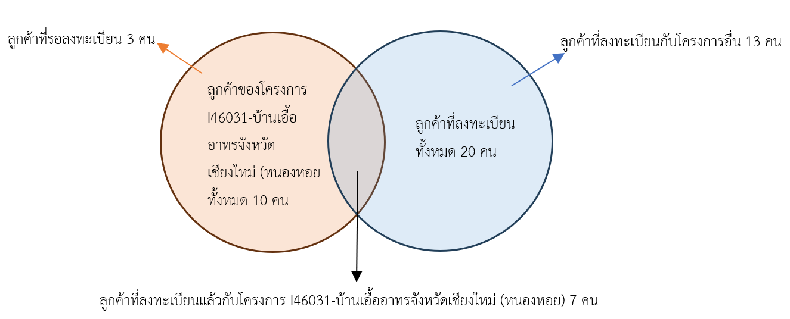
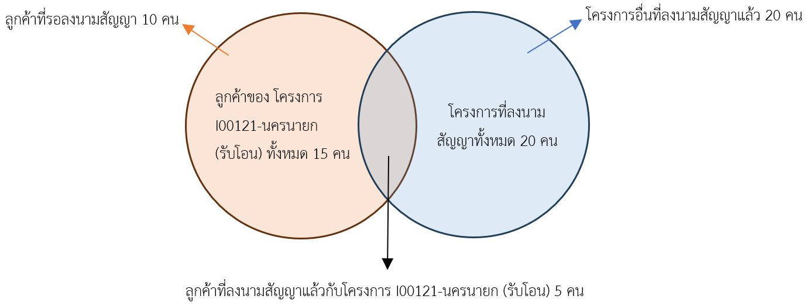
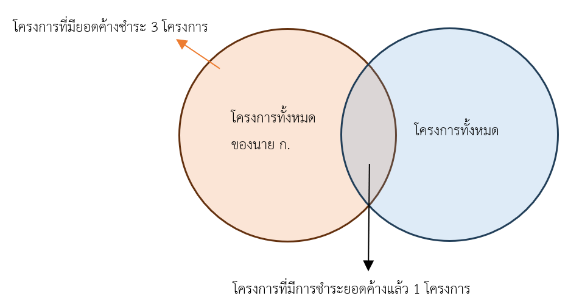
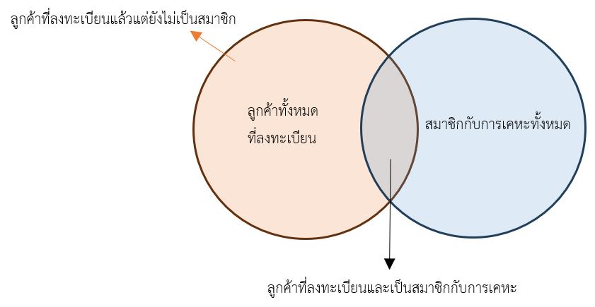
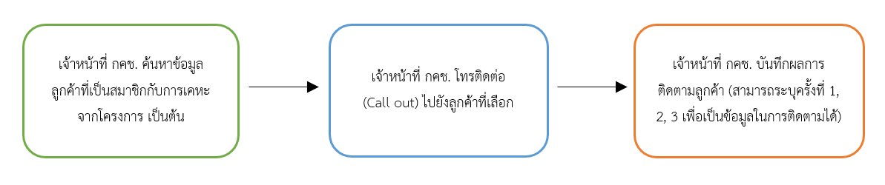
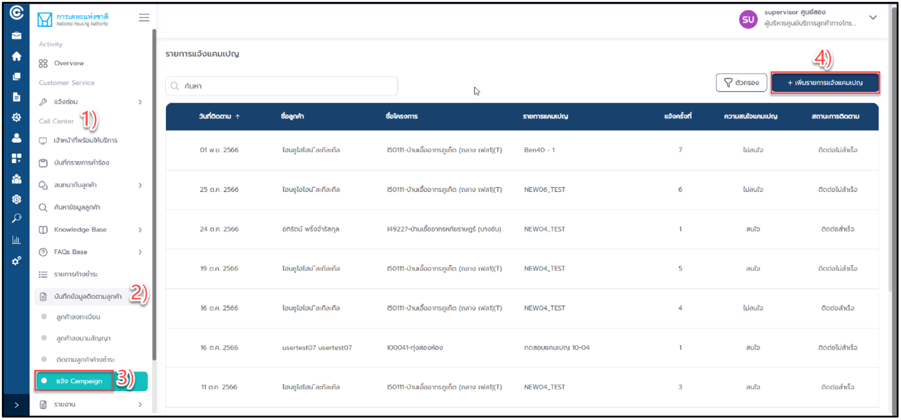

# ผู้ใช้งาน

## **บทที่ 1 วิธีการเข้าใช้งานในส่วนของแอปพลิเคชัน Call Center**

1. ไปที่ [centerapp.nha.co.th](https://uat-centerapp.nha.co.th/) จากนั้นเข้าสู่ระบบ
2. ไปที่ Navigation drawer แล้วคลิก “แอปพลิเคชันของฉัน”
3. คลิกเลือก “NHA-DT” ที่ด้านขวาบนของ Center App
4. คลิก “Call Center”

<figure><figcaption>
<strong>รูปภาพที่ 1</strong> การเข้าใช้งานแอปพลิเคชัน Call Center
</figcaption></figure>

## **บทที่ 2 การใช้งานในส่วนของเมนู Activity**

การใช้งานในส่วนของเมนู Activity

### 2.1 Overview

ผู้ใช้งานสามารถดูข้อมูลภาพรวม สรุปรายงานประจำวัน สายทั้งหมด เจ้าหน้าที่ทั้งหมด รอรับบริการ กำลังรับบริการ ได้รับบริการ ไม่ได้รับบริการ พร้อมให้บริการ ไม่พร้อมให้บริการ ปริมาณการใช้งานรายเดือน

#### **วิธีการเข้าใช้งานในส่วนของเมนู Overview**

1. ไปที่แอปพลิเคชัน “Call Center”
2. คลิกเมนู “Overview”

.png>)

## **บทที่ 3 การใช้งานในส่วนของเมนู Call Center**

ผู้ใช้งานสามารถบันทึกรายการคำร้อง สนทนากับลูกค้า เจ้าหน้าที่พร้อมให้บริการ ค้นหาข้อมูลลูกค้า Knowledge Base บันทึกข้อมูลติดตามลูกค้า FAQs Base บันทึกข้อมูลติดตามลูกค้า รายงาน และรายการค้างชำระได้

### 3.1 บันทึกรายการคำร้อง

#### **วิธีการสร้างรายการคำร้อง**

1. ไปที่เมนู “Call Center”
2. คลิก “บันทึกรายการคำร้อง”
3. คลิกปุ่ม “+สร้างรายการคำร้อง”
4. ผู้ใช้งานสามารถบันทึกร่างรายการคำร้อง คลิกปุ่ม “บันทึกร่าง”
5. ผู้ใช้งานกรอกข้อมูลรายการคำร้อง จากนั้นคลิกปุ่ม “Summary”

.png>)

.png>)

#### **วิธีการแก้ไขบันทึกคำร้อง**

1. ไปที่เมนู “Call Center”
2. คลิก “บันทึกรายการคำร้อง”
3. ผู้ใช้งานสามารถแก้ไขบันทึกคำร้องได้ โดยคลิกที่ “ไอคอนดินสอ”
4. ระบบจะแสดงหน้าบันทึกคำร้อง ผู้ใช้งานทำการแก้ไขข้อมูลบันทึกคำร้อง
5. คลิกปุ่ม “Summary”

.png>)

#### **วิธีการลบบันทึกคำร้อง**

1. ไปที่เมนู “Call Center”
2. คลิก “บันทึกรายการคำร้อง”
3. ผู้ใช้งานสามารถลบบันทึกคำร้องได้ โดยคลิกที่ “บันทึกคำร้อง” ที่ต้องการลบ
4. ระบบจะแสดงหน้ายืนยันลบข้อมูล
5. คลิกปุ่ม “ลบข้อมูล”

.png>)

#### **วิธีการดูรายการคำร้อง**

1. ไปที่เมนู “Call Center”
2. คลิก “บันทึกรายการคำร้อง”
3. ระบบจะแสดงหน้ารายการบันทึกคำร้อง
4. ผู้ใช้งานสามารถค้นหาบันทึกรายการคำร้อง โดยระบุข้อมูลที่ต้องการค้นหาได้ที่ “ช่องค้นหา”
5. ผู้ใช้งานสามารถใช้ตัวกรอง โดยคลิกปุ่ม “ตัวกรอง” สามารถกรอง ประเภทรับเรื่อง เรียงตาม ประเภท ได้

.png>)

### 3.2 สนทนากับลูกค้า

#### **3.2.1 สนทนากับลูกค้า (พนักงาน)**

**วิธีการสนทนากับลูกค้าสำหรับพนักงาน**

1. ไปที่เมนู “Call Center”
2. คลิก “สนทนากับลูกค้า”
3. คลิก “สนทนากับลูกค้า (พนักงาน)”
4. ผู้ใช้งานสามารถส่งข้อความตอบกลับข้อความลูกค้าได้โดยคลิกช่องข้อความ ระบุคำตอบ และคลิก “ไอคอนส่ง”หรือคลิก “Enter”
5. ผู้ใช้งานสามารถส่งไฟล์ หรือรูปตอบกลับข้อความลูกค้าได้โดยคลิก “ไอคอนแนบไฟล์” หรือ “ไอคอนรูปภาพ”เลือกข้อมูล และคลิก “ไอคอนส่ง”หรือคลิก “Enter”
6. ผู้ใช้งานสามารถค้นหาข้อความภายในแชทลูกค้าได้โดยคลิก “ไอคอนค้นหา” ระบุข้อมูลในช่องค้นหา
7. ผู้ใช้งานสามารถดูยอดค้างชำระลูกค้าได้โดยคลิกปุ่ม “ดูยอดค้างชำระ”
8. ผู้ใช้งานสามารถตรวจสอบข้อมูลการจองบ้านของลูกค้าได้โดยดูที่ส่วน “โครงการบ้าน”
9. ผู้ใช้งานสามารถดูรายละเอียด Recent Ticket ลูกค้าได้โดยคลิก “รายการ Recent Ticket”
10. ผู้ใช้งานสามารถส่งต่อการสนทนาระหว่างลูกค้าไปให้ Supervisor ได้โดยคลิก “ไอคอนส่งต่อ”
11. ผู้ใช้งานสามารถจบการสนทนาได้โดยคลิก “ไอคอนรูปคน”

.png>)

#### **3.2.2 รายการลูกค้ารับบริการ**

**วิธีการดูรายการลูกค้ารับบริการ**

1. ไปที่เมนู “Call Center”
2. คลิก “สนทนากับลูกค้า”
3. คลิก “สนทนากับลูกค้า (Supervisor)”
4. เจ้าหน้าที่สามารถดูเจ้าหน้าที่ที่กำลังปฏิบัติงาน รองาน หรือไม่ได้ใช้งาน
5. เจ้าหน้าที่สามารถดู Supervisor Available ที่กำลังปฏิบัติงาน รองาน หรือไม่ได้ใช้งาน
6. Supervisor สามารถดูเจ้าหน้าที่ที่กำลังปฏิบัติงาน รองาน หรือไม่ได้ใช้งาน
7. Supervisor สามารถดู Supervisor Available ที่กำลังปฏิบัติงาน รองาน หรือไม่ได้ใช้งาน
8. เจ้าหน้าที่สามารถเข้าถึงเมนูลูกค้ารอรับบริการ
9. เจ้าหน้าที่สามารถดูข้อความล่าสุดของการสนทนาของลูกค้าที่รอรับบริการ และกำลังรับบริการ ได้ที่ส่วน “Inbox”
10. เจ้าหน้าที่สามารถสนทนากับลูกค้าได้ โดยคลิกที่ “แชทการสนทนา”

.png>)

### 3.3 ค้นหาข้อมูลลูกค้า

#### **วิธีการค้นหาข้อมูลลูกค้า**

1. ไปที่เมนู “Call Center”
2. คลิก “ค้นหาข้อมูลลูกค้า”
3. ผู้ใช้งานสามารถค้นหาข้อมูลลูกค้าได้ โดยการใช้ตัวกรอง
   * เมื่อคลิกปุ่ม “ค้นหาข้อมูล” ระบบจะดึงข้อมูลตามที่ระบุในตัวกรองมาแสดงในส่วนของข้อมูลลูกค้า
   * เมื่อคลิกปุ่ม “ล้างข้อมูล” ระบบจะล้างข้อมูลที่ระบุในตัวกรอง และแสดงเป็นค่าว่าง
4. ผู้ใช้งานสามารถแก้ไขข้อมูลลูกค้าได้ โดยคลิกปุ่ม “แก้ไขข้อมูล” ระบบจะเปิดสิทธิ์ให้สามารถแก้ไขข้อมูลได้

.png>)

### 3.4 Knowledge Base

#### **วิธีการค้นหา Knowledge Base**

1. ไปที่เมนู “Call Center”
2. คลิกเมนู “Knowledge Base”
3. คลิก “Knowledge Base”
4. ผู้ใช้งานสามารถดูรายการ Knowledge Base ได้
5. ผู้ใช้งานสามารถค้นหา Knowledge Base ได้ โดยระบุข้อมูลใน “ช่องค้นหา”
6. ผู้ใช้งานสามารถดูรายละเอียดข้อมูล Knowledge Base ได้โดยคลิกที่การ์ด Knowledge Base
7. ผู้ใช้งานสามารถค้นหา Knowledge Base Group ได้ โดยระบุข้อมูลใน “ช่องค้นหา”
8. ผู้ใช้งานสามารถดูข้อมูลใน Knowledge Base Group ได้โดยคลิกที่การ์ด Knowledge Base Group

.png>)

### 3.5 FAQs Base

#### **วิธีการค้นหา FAQs Base**

1. ไปที่เมนู “Call Center”
2. คลิกเมนู “FAQs Base”
3. คลิก “FAQs Base”
4. ผู้ใช้งานสามารถดูรายการ FAQs Base ได้
5. ผู้ใช้งานสามารถค้นหา FAQs Base ได้ โดยระบุข้อมูลใน “ช่องค้นหา”
6. ผู้ใช้งานสามารถดูข้อมูลใน FAQs Base ได้โดยคลิกที่การ์ด FAQs Base Group
7. ผู้ใช้งานสามารถค้นหา FAQs Base ได้ โดยระบุข้อมูลใน “ช่องค้นหา”
8. ผู้ใช้งานสามารถดูรายละเอียดข้อมูล FAQs Base ได้โดยคลิกที่การ์ด FAQs Base

<figure><figcaption>
<strong>รูปภาพที่ 12</strong> หน้าจอสำหรับแสดงรายการ FAQs Base – วิธีการค้นหา FAQs Base
</figcaption></figure>

### 3.6 บันทึกข้อมูลติดตามลูกค้า

ผู้ใช้งานสามารถติดตามลูกค้าลงทะเบียน ติดตามลูกค้าลงนาม ติดตามลูกค้าค้างชำระ และดูรายการแจ้งแคมเปญได้ดังนี้

#### **3.6.1 การติดตามลูกค้าลงทะเบียน**

ผู้ใช้งานสามารถติดตามให้ลูกค้าที่ทำการรอลงทะเบียนให้มาลงทะเบียนของโครงการนั้นๆได้ โดยจะยกตัวอย่างแผนภาพและ Flow การทำงาน ดังนี้

* โครงการ I46031-บ้านเอื้ออาทรจังหวัดเชียงใหม่ (หนองหอย) มีลูกค้าทั้งหมด 10 คน ลงทะเบียนแล้ว 7 คน รอลงทะเบียน 3 คน
* ลูกค้าที่ลงทะเบียนทั้งหมด 20 คน ลูกค้าที่ลงทะเบียนกับโครงการ I46031-บ้านเอื้ออาทรจังหวัดเชียงใหม่ (หนองหอย) 7 คน ลูกค้าที่ลงทะเบียนกับโครงการอื่น 13 คน

<figure><figcaption>
<strong>รูปภาพที่ 13</strong> แผนภาพการติดตามลูกค้าลงทะเบียน
</figcaption></figure>

ดังนั้น ผู้ใช้งานต้องติดตามลูกค้าที่รอลงทะเบียนของโครงการ I46031-บ้านเอื้ออาทรจังหวัดเชียงใหม่ (หนองหอย) จำนวน 7 คน

<figure><figcaption>
<strong>รูปภาพที่ 14</strong> Flow การทำงานของเมนูบันทึกข้อมูลติดตามลูกค้า (ลูกค้าลงทะเบียน)
</figcaption></figure>

**วิธีการเพิ่มรายการติดตามลูกค้าลงทะเบียน**

1. ไปที่เมนู “Call Center”
2. คลิกเมนู “บันทึกข้อมูลติดตามลูกค้า”
3. คลิก “ลูกค้าลงทะเบียน”
4. คลิกปุ่ม “เพิ่มรายการติดตาม”
5. ผู้ใช้งานสามารถค้นหาข้อมูลลูกค้าได้ โดยการใช้ตัวกรอง
   * เมื่อคลิกปุ่ม “ค้นหาข้อมูล” ระบบจะดึงข้อมูลตามที่ระบุในตัวกรองมาแสดงในส่วนของผลการค้นหา
   * เมื่อคลิกปุ่ม “ล้างข้อมูล” ระบบจะล้างข้อมูลที่ระบุในตัวกรอง และแสดงเป็นค่าว่าง
6. ผู้ใช้งานกรอก “ข้อมูลลูกค้าลงทะเบียน”จากนั้นคลิกปุ่ม “บันทึกรายการติดตาม”
7. ถ้าต้องการยกเลิกการเพิ่มรายการติดตาม คลิกปุ่ม “ยกเลิก”

<figure><figcaption>
<strong>รูปภาพที่ 15</strong> หน้าจอสำหรับแสดงรายการติดตามลูกค้าลงทะเบียน– วิธีการเพิ่มรายการติดตามลูกค้าลงทะเบียน
</figcaption></figure>

<figure><figcaption>
<strong>รูปภาพที่ 16</strong> หน้าจอสำหรับแสดงรายการติดตามลูกค้าลงทะเบียน – วิธีการเพิ่มรายการติดตามลูกค้าลงทะเบียน
</figcaption></figure>

**วิธีการดูรายละเอียดการติดตามลูกค้าลงทะเบียน**

1. ไปที่เมนู “Call Center”
2. คลิกเมนู “บันทึกข้อมูลติดตามลูกค้า”
3. คลิก “ลูกค้าลงทะเบียน”
4. ผู้ใช้งานสามารถดูรายการติดตามลูกค้าลงทะเบียน ได้ที่ตารางรายการติดตามลูกค้าลงทะเบียน
5. ผู้ใช้งานสามารถค้นหารายการติดตามลูกค้าลงทะเบียนได้ โดยระบุข้อมูลใน “ช่องค้นหา”
6. ผู้ใช้งานสามารถใช้ตัวกรอง โดยคลิกปุ่ม “ตัวกรอง” สามารถกรอง หมายเลขโทรศัพท์ หมายเลขบัตรประชาชน โครงการ ชื่อ – นามสกุล บ้านเลขที่ ได้

.png>)

#### **3.6.2 การติดตามลูกค้าลงนามสัญญา**

ผู้ใช้งานสามารถติดตามให้ลูกค้าที่ยังไม่ได้ลงนามสัญญาให้มาลงนามสัญญาของโครงการนั้นๆได้ โดยจะยกตัวอย่างแผนภาพและ Flow การทำงาน ดังนี้

* โครงการ I00121-นครนายก (รับโอน) มีลูกค้าทั้งหมด 15 คน ลงนามสัญญาแล้ว 5 คน รอลงนามสัญญา 10 คน
* ลูกค้าที่ลงนามสัญญาทั้งหมด 25 คน ลูกค้าที่ลงนามสัญญากับโครงการ I00121-นครนายก (รับโอน) 5 คน ลูกค้าที่ลงทะเบียนกับโครงการอื่น 20 คน

<figure><figcaption>
<strong>รูปภาพที่ 18</strong> แผนภาพการติดตามลูกค้าลงนามสัญญา
</figcaption></figure>

ดังนั้น ผู้ใช้งานต้องติดตามลูกค้าที่ยังไม่ได้ลงนามสัญญาของโครงการ I00121-นครนายก (รับโอน) จำนวน 10 คน

<figure><figcaption>
<strong>รูปภาพที่ 19</strong> Flow การทำงานของเมนูบันทึกข้อมูลติดตามลูกค้า (ลูกค้าลงนามสัญญา)
</figcaption></figure>

**วิธีการเพิ่มรายการติดตามลูกค้าลงนามสัญญา**

1. ไปที่เมนู “Call Center”
2. คลิกเมนู “บันทึกข้อมูลติดตามลูกค้า”
3. คลิก “ลูกค้าลงนามสัญญา”
4. คลิกปุ่ม “เพิ่มรายการติดตาม”
5. ผู้ใช้งานสามารถค้นหาลูกค้าลงนามสัญญาได้ โดยการใช้ตัวกรอง
   * เมื่อคลิกปุ่ม “ค้นหาข้อมูล” ระบบจะดึงข้อมูลตามที่ระบุในตัวกรองมาแสดงในส่วนของผลการค้นหา
   * เมื่อคลิกปุ่ม “ล้างข้อมูล” ระบบจะล้างข้อมูลที่ระบุในตัวกรอง และแสดงเป็นค่าว่าง
6. ผู้ใช้งานกรอก “ข้อมูลติดตามลูกค้าลงนามสัญญา”จากนั้นคลิกปุ่ม “บันทึกรายการติดตาม”
7. ถ้าต้องการยกเลิกการเพิ่มรายการติดตาม คลิกปุ่ม “ยกเลิก”

.png>)

.png>)

**วิธีการดูรายละเอียดการติดตามลูกค้าลงนามสัญญา**

1. ไปที่เมนู “Call Center”
2. คลิกเมนู “บันทึกข้อมูลติดตามลูกค้า”
3. คลิก “ลูกค้าลงนามสัญญา”
4. ผู้ใช้งานสามารถดูรายการติดตามลูกค้าลงนามสัญญาได้ที่ตารางรายการติดตามลูกค้าลงนามสัญญา
5. ผู้ใช้งานสามารถค้นหารายการติดตามลูกค้าลงนามสัญญา ได้ โดยระบุข้อมูลใน “ช่องค้นหา”
6. ผู้ใช้งานสามารถใช้ตัวกรอง โดยคลิกปุ่ม “ตัวกรอง” สามารถกรอง หมายเลขโทรศัพท์ หมายเลขบัตรประชาชน โครงการได้

.png>)

#### **3.6.3 การติดตามลูกค้าค้างชำระ**

ผู้ใช้งานสามารถติดตามให้ลูกค้าที่มีรายการค้างชำระให้มาชำระยอดค้างของโครงการนั้นๆได้ โดยจะยกตัวอย่างแผนภาพและ Flow การทำงาน ดังนี้

* นาย ก. มีโครงการทั้งหมด 4 โครงการ โดยมียอดค้างชำระ 3 โครงการ ได้ทำการชำระยอดค้างแล้ว 1 โครงการ

<figure><figcaption>
<strong>รูปภาพที่ 23</strong> แผนภาพการติดตามลูกค้าค้างชำระ
</figcaption></figure>

ดังนั้น ผู้ใช้งานต้องติดตามลูกค้าที่มียอดค้างชำระจำนวน 3 โครงการ ของนาย ก.

<figure><figcaption>
<strong>รูปภาพที่ 24</strong> Flow การทำงานของเมนูบันทึกข้อมูลติดตามลูกค้า (ติดตามลูกค้าค้างชำระ)
</figcaption></figure>

**วิธีการเพิ่มรายการติดตามลูกค้าค้างชำระ**

1. ไปที่เมนู “Call Center”
2. คลิกเมนู “บันทึกข้อมูลติดตามลูกค้า”
3. คลิก “การติดตามลูกค้าค้างชำระ”
4. คลิกปุ่ม “เพิ่มรายการติดตาม”
5. ผู้ใช้งานสามารถค้นหาลูกค้าค้างชำระได้ โดยการใช้ตัวกรอง
   * เมื่อคลิกปุ่ม “ค้นหาข้อมูล” ระบบจะดึงข้อมูลตามที่ระบุในตัวกรองมาแสดงในส่วนของผลการค้นหา
   * เมื่อคลิกปุ่ม “ล้างข้อมูล” ระบบจะล้างข้อมูลที่ระบุในตัวกรอง และแสดงเป็นค่าว่าง
6. ผู้ใช้งานกรอก “ข้อมูลลูกค้าค้างชำระ”จากนั้นคลิกปุ่ม “บันทึกรายการติดตาม”
7. ถ้าต้องการยกเลิกการเพิ่มรายการติดตาม คลิกปุ่ม “ยกเลิก”

.png>)

.png>)

**วิธีการดูรายละเอียดการติดตามลูกค้าค้างชำระ**

1. ไปที่เมนู “Call Center”
2. คลิกเมนู “บันทึกข้อมูลติดตามลูกค้า”
3. คลิก “ติดตามลูกค้าค้างชำระ”
4. ผู้ใช้งานสามารถดูรายการติดตามลูกค้าค้างชำระได้ที่ตารางรายการติดตามลูกค้าค้างชำระ
5. ผู้ใช้งานสามารถค้นหารายการติดตามลูกค้าค้างชำระได้ โดยระบุข้อมูลใน “ช่องค้นหา”
6. ผู้ใช้งานสามารถใช้ตัวกรอง โดยคลิกปุ่ม “ตัวกรอง” สามารถกรอง หมายเลขโทรศัพท์ หมายเลขบัตรประชาชน โครงการได้

.png>)

#### **3.6.4 รายการแจ้ง Campaign**

ผู้ใช้งานสามารถแจ้งรายการแคมเปญให้ลูกค้าที่เป็นสมาชิกกับการเคหะได้ โดยจะยกตัวอย่างแผนภาพและ Flow การทำงาน ดังนี้

<figure><figcaption>
<strong>รูปภาพที่ 28</strong> แผนภาพการแจ้งรายการแคมเปญให้ลูกค้าที่เป็นสมาชิกกับการเคหะ
</figcaption></figure>

ดังนั้น ผู้ใช้งานต้องแจ้งรายการแคมเปญกับลูกค้าที่เป็นสมาชิกกับการเคหะ

<figure><figcaption>
<strong>รูปภาพที่ 29</strong> Flow การทำงานของเมนูบันทึกข้อมูลติดตามลูกค้า (แจ้ง Campaign)
</figcaption></figure>

**วิธีการเพิ่มรายการแจ้ง Campaign**

1. ไปที่เมนู “Call Center”
2. คลิกเมนู “บันทึกข้อมูลติดตามลูกค้า”
3. คลิก “แจ้ง Campaign”
4. คลิกปุ่ม “เพิ่มรายการแจ้ง Campaign”
5. ผู้ใช้งานสามารถค้นหาข้อมูลการแจ้งแคมเปญได้ โดยการใช้ตัวกรอง
   * เมื่อคลิกปุ่ม “ค้นหาข้อมูล” ระบบจะดึงข้อมูลตามที่ระบุในตัวกรองมาแสดงในส่วนของผลการค้นหา
   * เมื่อคลิกปุ่ม “ล้างข้อมูล” ระบบจะล้างข้อมูลที่ระบุในตัวกรอง และแสดงเป็นค่าว่าง
6. ผู้ใช้งานกรอก “ข้อมูลติดตามการแจ้งแคมเปญ”จากนั้นคลิกปุ่ม “บันทึกรายการติดตาม”
7. ถ้าต้องการยกเลิกการเพิ่มรายการติดตามการแจ้งแคมเปญ คลิกปุ่ม “ยกเลิก”

<figure><figcaption>
<strong>รูปภาพที่ 30</strong> หน้าจอสำหรับแสดงรายการแจ้ง Campaign – วิธีการเพิ่มรายการแจ้ง Campaign
</figcaption></figure>

<figure><figcaption>
<strong>รูปภาพที่ 31</strong> หน้าจอสำหรับแสดงรายการแจ้ง Campaign – วิธีการเพิ่มรายการแจ้ง Campaign
</figcaption></figure>

**วิธีการดูรายละเอียดรายการแจ้ง Campaign**

1. ไปที่เมนู “Call Center”
2. คลิกเมนู “บันทึกข้อมูลติดตามลูกค้า”
3. คลิก “แจ้ง Campaign”
4. ผู้ใช้งานสามารถดูรายการแจ้ง Campaign ได้ที่ตารางรายการแจ้ง Campaign
5. ผู้ใช้งานสามารถค้นหารายการแจ้ง Campaign ได้ โดยระบุข้อมูลใน “ช่องค้นหา”
6. ผู้ใช้งานสามารถใช้ตัวกรอง โดยคลิกปุ่ม “Filter” สามารถกรอง หมายเลขโทรศัพท์ หมายเลขบัตรประชาชน โครงการได้

<figure><figcaption>
<strong>รูปภาพที่ 32</strong> หน้าจอสำหรับแสดงรายการแจ้ง Campaign – วิธีการดูรายละเอียดรายการแจ้ง Campaign
</figcaption></figure>

### 3.7 รายการค้างชำระ

#### **วิธีการค้นหาข้อมูลลูกค้า**

1. ไปที่เมนู “**Call Center**”
2. คลิก “**รายการค้างชำระได้**”
3. ผู้ใช้งานสามารถค้นหารายการค้างชำระได้ โดยการใช้ตัวกรอง
   * เมื่อคลิกปุ่ม “**ค้นหาข้อมูล**” ระบบจะดึงข้อมูลตามที่ระบุในตัวกรองมาแสดงในส่วนของตารางรายการค้างชำระ
   * เมื่อคลิกปุ่ม “**ล้างข้อมูล**” ระบบจะล้างข้อมูลที่ระบุในตัวกรอง และแสดงเป็นค่าว่าง

<figure><figcaption>
<strong>รูปภาพที่ 33</strong> หน้าจอแสดงรายการค้างชำระ – วิธีการดูรายการค้างชำระ
</figcaption></figure>

## **บทที่ 4 การใช้งานในส่วนของเมนู Customer Service**

**วิธีการเข้าใช้งานในส่วนของเมนู Customer Service**

1. ไปที่ [centerapp.nha.co.th](https://uat-centerapp.nha.co.th/) จากนั้นเข้าสู่ระบบ
2. ไปที่ Navigation drawer แล้วคลิก “แอปพลิเคชันของฉัน”
3. คลิกเลือก “NHA-DT” ที่ด้านขวาบนของ Center App
4. คลิก “Call Center”

### 4.1 แจ้งซ่อม

#### **วิธีการดูรายการแจ้งซ่อมลูกค้า**

1. ไปที่เมนู “Customer Service”
2. คลิก “แจ้งซ่อม”
3. คลิก “สถานะการดำเนินการ”
4. ระบบจะนำทางไปที่ระบบ “Customer Service”

<figure><figcaption>
<strong>รูปภาพที่ 34</strong> หน้าจอระบบ Customer Service
</figcaption></figure>

## **บทที่ 5 การใช้งานในส่วนของเมนู Setting**

ผู้ใช้งานสามารถตั้งค่า Application และ Data Maintenanceโดยจะต้องมีสิทธิ์เป็นผู้ดูแล จึงจะสามารถทำการตั้งค่าได้

### 5.1 Application

ผู้ใช้งานสามารถตั้งค่าบัตรสมาชิก ตั้งค่า Data Support ตั้งค่าสุ่มรางวัลได้

#### **5.1.1 Notification**

**วิธีการใช้งาน Notification**

1. ไปที่เมนู “Setting”
2. คลิก “Notification”

**รูปภาพที่ 35** หน้าจอ Setting – Notification

**วิธีการลบบัตรสมาชิก**

1. ไปที่เมนู “Data Maintenance”
2. คลิก “ตั้งค่าบัตรสมาชิก”
3. ผู้ใช้งานสามารถลบบัตรสมาชิกได้ โดยคลิกที่ “บัตรสมาชิก” ที่ต้องการลบ
4. ระบบจะแสดงหน้าข้อมูลของบัตรสมาชิก
5. คลิกปุ่ม “ลบ”

<figure><figcaption>
<strong>รูปภาพที่ 36</strong> หน้าจอ Data Maintenance – การลบบัตรสมาชิก
</figcaption></figure>

<figure><figcaption>
<strong>รูปภาพที่ 37</strong> หน้าจอ Data Maintenance – การลบบัตรสมาชิก
</figcaption></figure>

**วิธีการแก้ไขข้อมูลบัตรสมาชิก**

1. ไปที่เมนู “Data Maintenance”
2. คลิก “ตั้งค่าบัตรสมาชิก”
3. ผู้ใช้งานสามารถแก้ไขข้อมูลบัตรสมาชิกได้ โดยคลิกที่ “บัตรสมาชิก” ที่ต้องการแก้ไข
4. ระบบจะแสดงหน้าข้อมูลของบัตรสมาชิก ผู้ใช้งานทำการแก้ไขข้อมูลบัตรสมาชิก
5. คลิกปุ่ม “แก้ไข”

<figure><figcaption>
<strong>รูปภาพที่ 38</strong> หน้าจอ Data Maintenance – การแก้ไขบัตรสมาชิก
</figcaption></figure>

<figure><figcaption>
<strong>รูปภาพที่ 39</strong> หน้าจอ Data Maintenance – การแก้ไขบัตรสมาชิก
</figcaption></figure>

**วิธีการดูรายการบัตรสมาชิก**

1. ไปที่เมนู “Data Maintenance”
2. คลิก “ตั้งค่าบัตรสมาชิก”
3. ระบบจะแสดงหน้ารายการบัตรสมาชิก
4. ผู้ใช้งานสามารถค้นหาบัตรสมาชิก โดยระบุข้อมูลที่ต้องการค้นหาได้ที่ “ช่องค้นหา”

<figure><figcaption>
<strong>รูปภาพที่ 40</strong> หน้าจอ Data Maintenance – การดูรายการบัตรสมาชิก
</figcaption></figure>

## **บทที่ 6 การใช้งานในส่วนของเมนูส่วนเสริม**

#### **วิธีการเข้าใช้งานแบบสอบถาม**

1. ไปที่เมนู “ส่วนเสริม”
2. คลิก “แบบสอบถาม”

<figure><figcaption>
<strong>รูปภาพที่ 41</strong> หน้าจอการใช้งานในส่วนของส่วนเสริม – แบบสอบถาม
</figcaption></figure>
