# เจ้าหน้าที่ (ทอ.)

## **บทที่ 1 วิธีการเข้าใช้งานแอปพลิเคชัน Customer Service (ภายนอก)**

**วิธีการเข้าใช้งานในส่วนของแอปพลิเคชัน Customer Service (ภายนอก)**

1. ไปที่ [centerapp.nha.co.th](https://uat-centerapp.nha.co.th/) จากนั้นเข้าสู่ระบบ
2. ไปที่ Navigation drawer แล้วคลิก “แอปพลิเคชันของฉัน”
3. คลิก “Customer Service”

.png>)

## **บทที่ 2 การใช้งานในส่วนของเมนู Customer Service**

การใช้งานในส่วนของเมนู Customer Service ผู้ใช้งานสามารถแจ้งซ่อม โดยแจ้งบริการภายในได้ดังนี้

### 2.1 แจ้งซ่อม

#### **2.1.1 รายการแจ้งซ่อมเจ้าหน้าที่**

ผู้ใช้งานสามารถยื่นคำร้องคำร้องแจ้งซ่อมเจ้าหน้าที่ได้โดยมีขั้นตอน ดังต่อไปนี้

**วิธีการแจ้งซ่อมเจ้าหน้าที่**

1. ไปที่แอปพลิเคชัน “Customer Service”
2. คลิกเมนู “แจ้งซ่อม”
3. คลิก “รายการแจ้งซ่อมเจ้าหน้าที่”
4. คลิก “+ แจ้งซ่อม”
5. ระบบแสดงหน้า ยื่นคำร้องแจ้งซ่อมเจ้าหน้าที่ จากนั้นผู้ใช้งานกรอกข้อมูลคำร้องการแจ้งซ่อม

.png>)

**วิธีการกรอกข้อมูลการแจ้งซ่อมของเจ้าหน้าที่**

1. ระบบแสดงหน้า **ยื่นคำร้องแจ้งซ่อมเจ้าหน้าที่** จากนั้นผู้ใช้งานกรอกข้อมูลคำร้องการแจ้งซ่อมตามประเภทการซ่อม
   * เจ้าหน้าที่เลือกประเภทการซ่อม **“ลูกค้า/คู่สัญญา”**
     1. ระบบแสดงหน้าจอกรอกข้อมูลคำร้องแจ้งซ่อม จากนั้นผู้ใช้งานกรอกข้อมูลคำร้องการแจ้งซ่อม
     2. เมื่อผู้ใช้งานกรอกข้อมูลเรียบร้อยแล้ว คลิกปุ่ม **“บันทึกร่าง”**
     3. ระบบบันทึกร่างรายการแจ้งซ่อม และแสดงปุ่มแจ้งซ่อม
     4. เจ้าหน้าที่คลิก **“แจ้งซ่อม”** เพื่อส่งรายการซ่อม

<figure><figcaption>
<strong>รูปภาพที่ 3</strong> วิธีการแจ้งซ่อม - กรอกข้อมูลประเภทการซ่อม “ลูกค้า/คู่สัญญา”
</figcaption></figure>

.png>)

.png>)

1. ระบบแสดงหน้า **ยื่นคำร้องแจ้งซ่อมเจ้าหน้าที่** จากนั้นผู้ใช้งานกรอกข้อมูลคำร้องการแจ้งซ่อมตามประเภทการซ่อม
   * เจ้าหน้าที่เลือกประเภทการซ่อม **“เจ้าหน้าที่แจ้งเอง”**
     1. ระบบแสดงหน้าจอกรอกข้อมูลคำร้องแจ้งซ่อม จากนั้นผู้ใช้งานกรอกข้อมูลคำร้องการแจ้งซ่อม
     2. เมื่อผู้ใช้งานกรอกข้อมูลเรียบร้อยแล้ว คลิกปุ่ม “**บันทึกร่าง**”
     3. ระบบบันทึกร่างรายการแจ้งซ่อม และแสดงปุ่มแจ้งซ่อม
     4. เจ้าหน้าที่คลิก **“แจ้งซ่อม”** เพื่อส่งรายการซ่อม

.png>)

.png>)

.png>)

**วิธีการยกเลิกคำร้องแจ้งซ่อมเจ้าหน้าที่**

1. ไปที่แอปพลิเคชัน “Customer Service”
2. คลิกเมนู “แจ้งซ่อม”
3. คลิก “รายการแจ้งซ่อมเจ้าหน้าที่”
4. ผู้ใช้งานสามารถยกเลิกคำร้องหรือแก้ไขคำร้องแจ้งซ่อมเจ้าหน้าที่ได้ โดยคลิกที่ “ไอคอนดินสอ” ระบบจะแสดงหน้ารายละเอียดข้อมูลการแจ้งซ่อม จากนั้นผู้ใช้งานคลิก “ยกเลิกคำร้อง” ระบบแสดงหน้าจอให้ระบุสาเหตุการยกเลิกการแจ้งซ่อม
5. เมื่อผู้ใช้งานกรอกสาเหตุการยกเลิกการแจ้งซ่อมสำเร็จ จากนั้นคลิก “ยืนยัน” เพื่อยกเลิกคำร้อง

.png>)

.png>)

.png>)

**วิธีการแก้ไขคำร้องแจ้งซ่อมเจ้าหน้าที่**

1. ไปที่แอปพลิเคชัน “Customer Service”
2. คลิกเมนู “แจ้งซ่อม”
3. คลิก “รายการแจ้งซ่อมเจ้าหน้าที่”
4. ผู้ใช้งานสามารถแก้ไขคำร้องแจ้งซ่อมเจ้าหน้าที่ได้ โดยคลิกที่ “ไอคอนดินสอ”
5. ระบบจะแสดงหน้ายื่นคำร้องแจ้งซ่อมเจ้าหน้าที่ ผู้ใช้งานทำการแก้ไขข้อมูลคำร้องการแจ้งซ่อม
6. คลิกปุ่ม “แจ้งซ่อม”

<figure><figcaption>
<strong>รูปภาพที่ 12</strong> รายการแจ้งซ่อมเจ้าหน้าที่ – วิธีการแก้ไขคำร้องแจ้งซ่อมเจ้าหน้าที่
</figcaption></figure>

<figure><figcaption>
<strong>รูปภาพที่ 13</strong> รายการแจ้งซ่อมเจ้าหน้าที่ – วิธีการแก้ไขคำร้องแจ้งซ่อมเจ้าหน้าที่
</figcaption></figure>

**วิธีการดูรายละเอียดรายการแจ้งซ่อมเจ้าหน้าที่**

1. ไปที่แอปพลิเคชัน “Customer Service”
2. คลิกเมนู “แจ้งซ่อม”
3. คลิก “รายการแจ้งซ่อมเจ้าหน้าที่”
4. ระบบจะแสดงหน้ารายการคำร้องแจ้งซ่อม (เจ้าหน้าที่)
5. ผู้ใช้งานสามารถค้นหารายการคำร้องแจ้งซ่อม (เจ้าหน้าที่) โดยระบุข้อมูลที่ต้องการค้นหาได้ที่ “ช่องค้นหา”
6. ผู้ใช้งานสามารถใช้ตัวกรอง โดยคลิกปุ่ม “Filter” สามารถกรอง เลขคำร้องแจ้งซ่อม วันที่แจ้งซ่อม ประเภทการซ่อม โครงการ บ้าน/ห้องเลขที่ หรือ สถานะ ได้
7. ผู้ใช้งานสามารถคลิก “รายการคำร้องแจ้งซ่อม” เพื่อดูรายละเอียดข้อมูลคำร้องแจ้งซ่อมได้

.png>)

### 2.2 สถานะการดำเนินการ

ผู้ใช้งานสามารถดูบันทึกสถานะ การดำเนินการ และสอบถามสถานะ

#### **วิธีการตรวจสอบรายเอียดสถานะการดำเนินการ**

1. ไปที่แอปพลิเคชัน “Customer Service”
2. คลิกเมนู “สถานะการดำเนินการ”
3. ผู้ใช้งานสามารถดูรายละเอียดสถานะการดำเนินการ ได้ที่ตาราง การหน้าบันทึกสถานะ การดำเนินการ และสอบถามสถานะ
4. ผู้ใช้งานสามารถค้นหารายการ โดยระบุข้อมูลที่ต้องการค้นหาได้ที่ “ช่องค้นหา”
5. ผู้ใช้งานสามารถใช้ตัวกรอง โดยคลิกปุ่ม “Filter” สามารถกรอง เลขคำร้องแจ้งซ่อม วันที่แจ้งซ่อม ประเภทการซ่อม โครงการ บ้าน/ห้องเลขที่ สถานะ ได้

<figure><figcaption>
<strong>รูปภาพที่ 15</strong> หน้าจอสถานะการดำเนินการ – วิธีการตรวจสอบรายเอียดสถานการณ์ดำเนินการ
</figcaption></figure>

.png>)

### 2.3 รับคำร้องแจ้งซ่อม

ผู้ใช้งานสามารถดูรายการคำร้องแจ้งซ่อม เลือกหน่วยงานที่ต้องการให้สำรวจ และส่งออกข้อมูลได้ดังนี้

#### **2.3.1 รับคำร้องแจ้งซ่อม**

**วิธีการรับคำร้องแจ้งซ่อม**

1. ไปที่แอปพลิเคชัน “Customer Service”
2. คลิกเมนู “รับคำร้องแจ้งซ่อม”
3. ผู้ใช้งานสามารถดูรายละเอียดคำร้องแจ้งซ่อม ได้ที่ตาราง คำร้องแจ้งซ่อม
4. ผู้ใช้งานสามารถค้นหารายการคำร้องแจ้งซ่อม โดยระบุข้อมูลที่ต้องการค้นหาได้ที่ “ช่องค้นหา”
5. ผู้ใช้งานสามารถใช้ตัวกรอง โดยคลิกปุ่ม “Filter” สามารถกรอง เลขคำร้องแจ้งซ่อม วันที่แจ้งซ่อม ประเภทการซ่อม โครงการ บ้าน/ห้องเลขที่ สถานะ ได้
6. ผู้ใช้งานสามารถส่งออกข้อมูลได้ โดยคลิกปุ่ม “ส่งออกข้อมูล”
7. ผู้ใช้งานคลิก “รับคำร้อง” เพื่อรับคำร้องแจ้งซ่อม

<figure><figcaption>
<strong>รูปภาพที่ 17</strong> หน้าจอรับคำร้องแจ้งซ่อม – วิธีการดูรายการคำร้องและส่งออกข้อมูล
</figcaption></figure>

#### **2.3.2 เลือกหน่วยงานรับคำร้องแจ้งซ่อม**

**วิธีการเลือกหน่วยงานรับคำร้องแจ้งซ่อม**

1. ผู้ใช้งานคลิกเลือก “รับคำร้อง” จากรายการคำร้องทั้งหมด
2. ระบบแสดงรายละเอียดคำร้องแจ้งซ่อม จากนั้นผู้ใช้งานคลิกเลือกรายการ“เลือกหน่วยงานสำรวจ”
   1. “ส่งเรื่องให้ทีม Fast”
   2. “ส่งซ่อมภายนอก (ทอ., ปบ., สคล./สคจ.)”
3. ผู้ใช้งานคลิก “รับคำร้อง”

.png>)

### 2.4 สำรวจซ่อม

ผู้ใช้งานสามารถดูรายการบันทึกสำรวจซ่อม เปิดบันทึกสำรวจซ่อม ส่งรายการสำรวจซ่อมให้ลูกค้ายืนยันยืนยันรายการแจ้งซ่อมได้ดังนี้

#### **2.4.1 ดูรายการบันทึกสำรวจซ่อม**

**วิธีการดูรายการบันทึกสำรวจซ่อม**

1. ไปที่แอปพลิเคชัน “**Customer Service**”
2. คลิกเมนู “สำรวจซ่อม”
3. ผู้ใช้งานสามารถดูรายการบันทึกสำรวจซ่อม ได้ที่ตาราง รายการบันทึกสำรวจซ่อม
4. ผู้ใช้งานสามารถค้นหารายการบันทึกสำรวจซ่อม โดยระบุข้อมูลที่ต้องการค้นหาได้ที่ “ช่องค้นหา”
5. ผู้ใช้งานสามารถใช้ตัวกรอง โดยคลิกปุ่ม “Filter” สามารถกรอง เลขคำร้องแจ้งซ่อม วันที่แจ้งซ่อม ประเภทการซ่อม โครงการ บ้าน/ห้องเลขที่ ผลการยืนยันซ่อม ผู้รับผิดชอบ สถานะ ได้

<figure><figcaption>
<strong>รูปภาพที่ 19</strong> หน้าจอสำรวจซ่อม – วิธีการดูรายการบันทึกสำรวจซ่อม
</figcaption></figure>

#### **2.4.2 บันทึกสำรวจซ่อม**

**วิธีการบันทึกสำรวจซ่อม**

1. ไปที่แอปพลิเคชัน “Customer Service”
2. คลิกเมนู “สำรวจซ่อม”
3. คลิกปุ่ม “บันทึกสำรวจซ่อม”
4. ผู้ใช้งานคลิกเลือก “ประเภทซ่อมย่อย” จากนั้นเลือก “แบบฟอร์มสำรวจ”
5. ระบบแสดงฟอร์มให้กรอก “รายละเอียดการสำรวจซ่อม”
6. ผู้ใช้งานสามารถเพิ่มรายการวัสดุในรายละเอียดการสำรวจซ่อมได้โดยคลิก “ไอคอนเพิ่ม (+)”
7. เมื่อคลิกไอคอนเพิ่ม ระบบจะแสดงหน้าจอให้เลือก “รายการวัสดุ”
8. ผู้ใช้งานสามารถคลิก “ไอคอนถังขยะ” เพื่อลบรายการวัสดุได้
9. ผู้ใช้งานต้องคลิก “Choose file” เพื่ออัปโหลดรูปภาพระบุรายการวัสดุ
10. เมื่อผู้ใช้งานกรอกข้อมูลในฟอร์มครบถ้วน จากนั้นคลิก “บันทึกสำรวจซ่อม”
11. ผู้ใช้งานสามารถคลิก “ยกเลิกคำร้อง” เพื่อทำยกเลิกรายการคำร้องได้

<figure><figcaption>
<strong>รูปภาพที่ 20</strong> หน้าจอสำรวจซ่อม – วิธีการบันทึกสำรวจซ่อม
</figcaption></figure>

<figure><figcaption>
<strong>รูปภาพที่ 21</strong> หน้าจอสำรวจซ่อม – วิธีการบันทึกสำรวจซ่อม
</figcaption></figure>

<figure>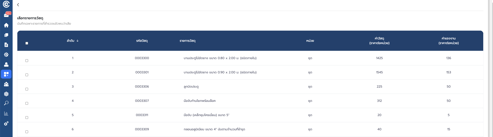<figcaption>
<strong>รูปภาพที่ 22</strong> หน้าจอสำรวจซ่อม – เลือกรายการวัสดุ
</figcaption></figure>

<figure>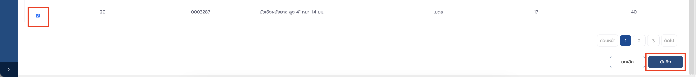<figcaption>
<strong>รูปภาพที่ 23</strong> หน้าจอสำรวจซ่อม – บันทึกสำรวจซ่อม
</figcaption></figure>

<figure>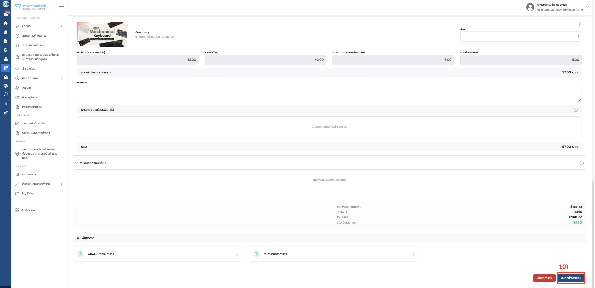<figcaption>
<strong>รูปภาพที่ 24</strong> หน้าจอสำรวจซ่อม – ยกเลิกคำร้อง
</figcaption></figure>

#### **2.4.3 คัดลอกบันทึกสำรวจซ่อม**

ผู้ใช้งานสามารถทำการคัดลอกบันทึกข้อมูล เมื่อคำร้องแจ้งซ่อมเดิมถูกยกเลิก และผู้ใช้งานทำการแจ้งแทนลูกค้าหรือลูกค้าแจ้งซ่อมเข้ามาอีกครั้ง โดยหากต้องการใช้ข้อมูลเดิมที่เคยแจ้งอีกครั้ง ผู้ใช้งานสามารถทำการคัดลอกบันทึกข้อมูลเดิมจากคำร้องแจ้งซ่อมที่ถูกยกเลิกได้

**วิธีการคัดลอกบันทึกสำรวจซ่อม**

1. ไปที่แอปพลิเคชัน “Customer Service”
2. คลิกเมนู “สำรวจซ่อม”
3. คลิกปุ่ม “บันทึกสำรวจซ่อม” ที่รายการแจ้งซ่อมที่ต้องการ
4. ระบบแสดงรายละเอียดการแจ้งซ่อม จากนั้นคลิก “คัดลอกบันทึก” เพื่อทำการคัดลอกข้อมูลเดิม

<figure>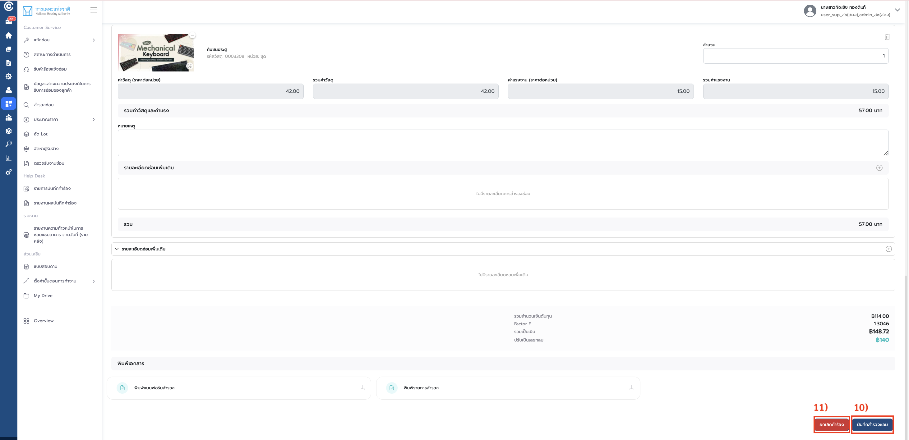<figcaption>
<strong>รูปภาพที่ 25</strong> หน้าจอสำรวจซ่อม – คัดลอกบันทึกสำรวจซ่อม
</figcaption></figure>

#### **2.4.4 ส่งรายการสำรวจซ่อมให้ลูกค้ายืนยัน**

ผู้ใช้งานทำการส่งรายการแจ้งซ่อมให้ลูกค้ายืนยัน

**วิธีการส่งรายการสำรวจให้ลูกค้ายืนยัน**

1. ไปที่แอปพลิเคชัน “Customer Service”
2. คลิกเมนู “สำรวจซ่อม”
3. ผู้ใช้งานสามารถคลิกรายการสำรวจซ่อมที่ต้องการส่งให้ลูกค้ายืนยัน โดยคลิกปุ่ม “บันทึกสำรวจซ่อม”
4. ผู้ใช้งานสามารถทำการบันทึกข้อมูลสำรวจซ่อมได้ โดยคลิกปุ่ม “บันทึกสำรวจซ่อม”
5. ผู้ใช้งานสามารถทำการส่งรายการสำรวจซ่อมให้ลูกค้ายืนยันได้ โดยคลิกปุ่ม “ส่งลูกค้ายืนยันอนุมัติ”

<figure>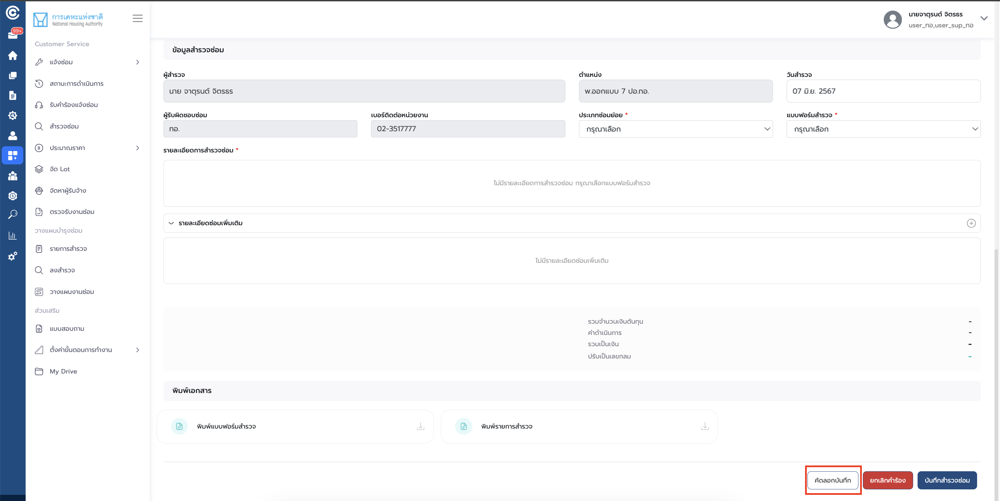<figcaption>
<strong>รูปภาพที่ 26</strong> หน้าจอสำรวจซ่อม – วิธีการส่งรายการสำรวจให้ลูกค้ายืนยัน
</figcaption></figure>

<figure>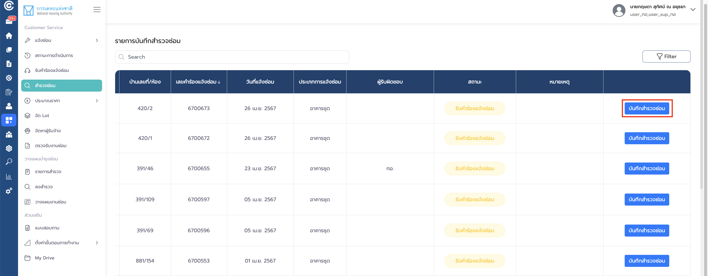<figcaption>
<strong>รูปภาพที่ 27</strong> หน้าจอสำรวจซ่อม – วิธีการส่งรายการสำรวจให้ลูกค้ายืนยัน
</figcaption></figure>

<figure>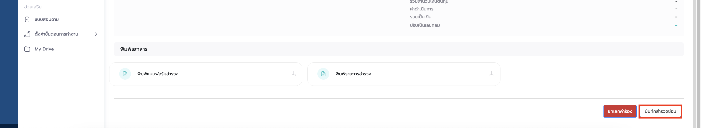<figcaption>
<strong>รูปภาพที่ 28</strong> หน้าจอสำรวจซ่อม – วิธีการส่งรายการสำรวจให้ลูกค้ายืนยัน
</figcaption></figure>

#### **2.4.5 ยืนยันสำรวจรายการซ่อม**

ผู้ใช้งานทำการส่งยืนยันสำรวจซ่อม

**วิธีการยืนยันสำรวจรายการซ่อม**

1. ไปที่แอปพลิเคชัน “Customer Service”
2. คลิกเมนู “สำรวจซ่อม”
3. ผู้ใช้งานสามารถคลิกรายการสำรวจซ่อมที่ต้องการส่งให้ลูกค้ายืนยัน โดยคลิกปุ่ม “บันทึกสำรวจซ่อม”
4. ผู้ใช้งานสามารถทำการบันทึกข้อมูลสำรวจซ่อมได้ โดยคลิกปุ่ม “บันทึกสำรวจซ่อม”
5. ผู้ใช้งานสามารถทำการยืนยันรายการสำรวจซ่อม โดยคลิกปุ่ม “ส่งเพื่อยืนยันสำรวจซ่อม”

<figure>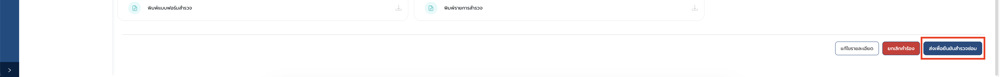<figcaption>
<strong>รูปภาพที่ 29</strong> หน้าจอสำรวจซ่อม – วิธีการส่งรายการสำรวจให้ลูกค้ายืนยัน
</figcaption></figure>

### 2.5 ประมาณราคา

#### **2.5.1 การจ่ายงานเพื่อประมาณราคา**

**ดูรายการการจ่ายงานเพื่อประมาณราคา**

1. ไปที่แอปพลิเคชัน “Customer Service”
2. คลิกเมนู “ประมาณราคา”
3. คลิก “การจ่ายงานเพื่อประมาณราคา”
4. ผู้ใช้งานสามารถดูรายละเอียดบันทึกการจ่ายงาน เพื่อประมาณราคาได้ที่ตาราง บันทึกการจ่ายงาน เพื่อประมาณราคา โดยสามารถเลือกดูรายการทั้งหมด และประวัติมอบหมายงานได้
5. ผู้ใช้งานสามารถค้นหารายการบันทึกการจ่ายงาน เพื่อประมาณราคา โดยระบุข้อมูลที่ต้องการค้นหาได้ที่ “ช่องค้นหา”
6. ผู้ใช้งานสามารถใช้ตัวกรอง โดยคลิกปุ่ม “Filter” สามารถกรอง เลขคำร้องแจ้งซ่อม โครงการ บ้าน/ห้องเลขที่ วันที่แจ้งซ่อม ผู้ประมาณราคา สถานการณ์ประมาณราคา วันที่ธนาคารอนุมัติ ประเภทการแจ้งซ่อม ได้

<figure>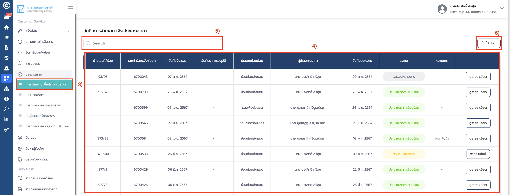<figcaption>
<strong>รูปภาพที่ 30</strong> หน้าจอการประมาณราคา – วิธีการดูรายละเอียดบันทึกการจ่ายงาน เพื่อประมาณราคา
</figcaption></figure>

#### **2.5.2 การจ่ายงานเพื่อประมาณราคา**

**วิธีการจ่ายงานเพื่อประมาณราคา**

1. ไปที่แอปพลิเคชัน “Customer Service”
2. คลิกเมนู “ประมาณราคา”
3. คลิก “การจ่ายงานเพื่อประมาณราคา”
4. คลิก “จ่ายงาน” รายการประมาณราคา
5. ระบบแสดงหน้าจอรายละเอียดการประมาณราคา และผู้ใช้งานทำการ “กรอกข้อมูล” วันที่จ่ายงาน ชื่อผู้ประมาณราคา ตำแหน่งผู้ประมาณ
6. จากนั้นผู้ใช้งานทำการยืนยันการจ่ายงาน โดยคลิกปุ่ม “ส่งเพื่อประมาณราคา”

<figure>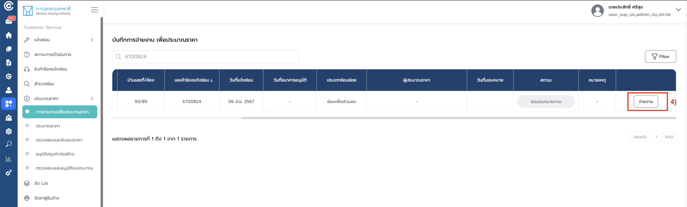<figcaption>
<strong>รูปภาพที่ 31</strong> หน้าจอการประมาณราคา – วิธีการดูรายละเอียดบันทึกการจ่ายงาน เพื่อประมาณราคา
</figcaption></figure>

<figure>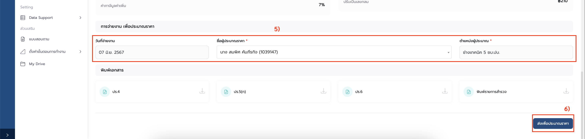<figcaption>
<strong>รูปภาพที่ 32</strong> หน้าจอการประมาณราคา – วิธีการดูรายละเอียดบันทึกการจ่ายงาน เพื่อประมาณราคา
</figcaption></figure>

#### **2.5.3 การจ่ายงานใหม่เพื่อประมาณราคา**

**วิธีการจ่ายงานเพื่อประมาณราคา**

1. ไปที่แอปพลิเคชัน “Customer Service”
2. คลิกเมนู “ประมาณราคา”
3. คลิก “การจ่ายงานเพื่อประมาณราคา”
4. คลิก “จ่ายงานใหม่” รายการประมาณราคา
5. ระบบแสดงหน้าจอรายละเอียดการประมาณราคา และผู้ใช้งานทำการ “กรอกข้อมูล” วันที่จ่ายงาน ชื่อผู้ประมาณราคา ตำแหน่งผู้ประมาณใหม่
6. จากนั้นผู้ใช้งานทำการยืนยันการจ่ายงาน โดยคลิกปุ่ม “ส่งเพื่อประมาณราคา”

<figure>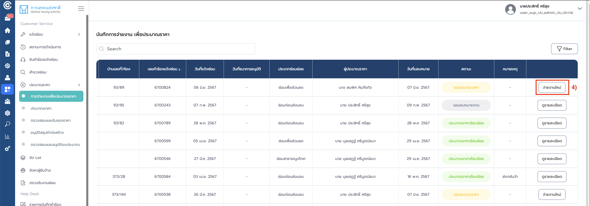<figcaption>
<strong>รูปภาพที่ 33</strong> หน้าจอการประมาณราคา – วิธีการจ่ายงานใหม่
</figcaption></figure>

<figure>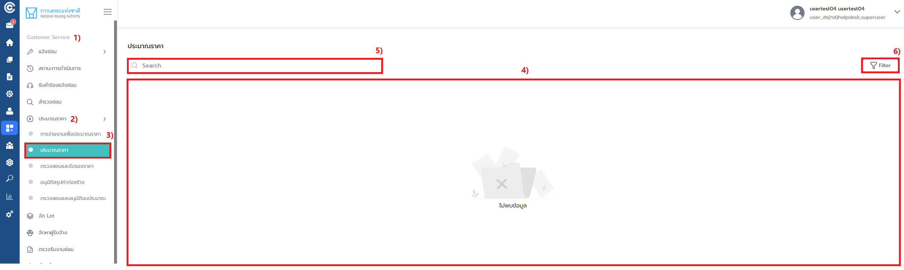<figcaption>
<strong>รูปภาพที่ 34</strong> หน้าจอการประมาณราคา – วิธีการจ่ายงานใหม่
</figcaption></figure>

#### **2.5.4 ประมาณราคา**

**วิธีการดูรายการประมาณราคา**

1. ไปที่แอปพลิเคชัน “Customer Service”
2. คลิกเมนู “ประมาณราคา”
3. คลิก “ประมาณราคา”
4. ผู้ใช้งานสามารถดูรายการประมาณราคา ได้ที่ตาราง ประมาณราคา
5. ผู้ใช้งานสามารถค้นหารายการประมาณราคา โดยระบุข้อมูลที่ต้องการค้นหาได้ที่ “ช่องค้นหา”
6. ผู้ใช้งานสามารถใช้ตัวกรอง โดยคลิกปุ่ม “Filter” สามารถกรอง วันที่แจ้งซ่อม ประเภทการแจ้งซ่อม โครงการ ได้

<figure>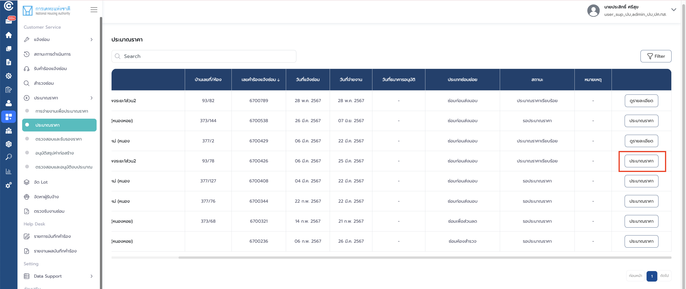<figcaption>
<strong>รูปภาพที่ 35</strong> หน้าจอการประมาณราคา – วิธีการดูรายการประมาณราคา
</figcaption></figure>

**วิธีการดำเนินการประมาณราค**

1. ไปที่แอปพลิเคชัน “Customer Service”
2. คลิกเมนู “ประมาณราคา”
3. คลิก “ประมาณราคา”
4. ผู้ใช้งานคลิก “ประมาณราคา” ในรายการประมาณราคาที่ต้องการ
5. ผู้ใช้งานเลือกราคากลางวัสดุ และราคากลางค่าแรงการเคหะฯ จากนั้นคลิกปุ่ม “บันทึกรายการ”
6. ผู้ใช้งานสามารถส่งกลับแก้ไขการประมาณราคาได้โดยคลิกปุ่ม “ส่งกลับเพื่อแก้ไข”
7. ผู้ใช้งานสามารถทำการยืนยันการประมาณราคาได้โดย คลิกปุ่ม “ส่งตรวจสอบและรับรองราคา”

<figure>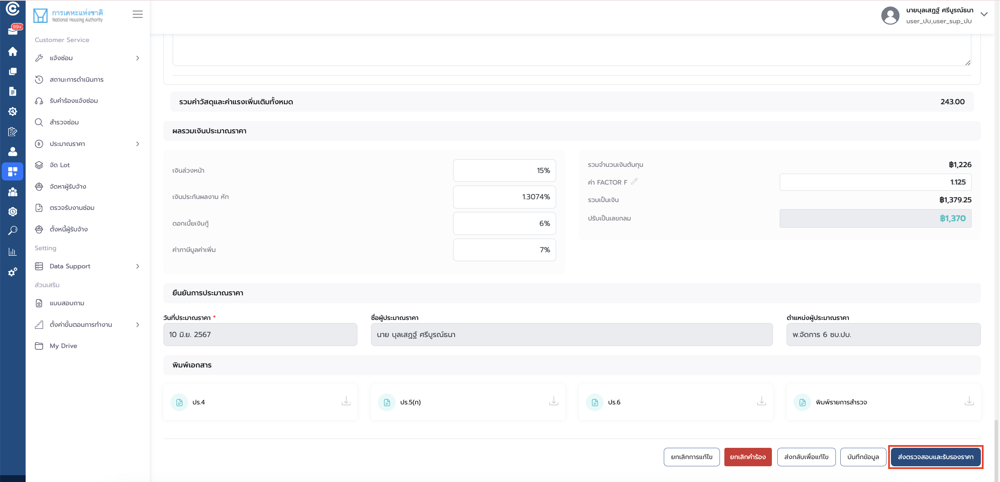<figcaption>
<strong>รูปภาพที่ 36</strong> หน้าจอการประมาณราคา – วิธีการดำเนินการประมาณราคา
</figcaption></figure>

<figure>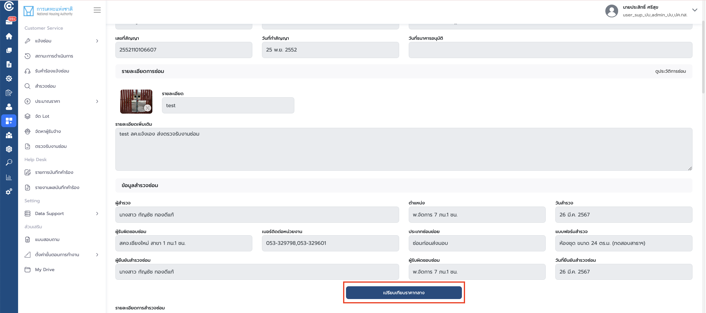<figcaption>
<strong>รูปภาพที่ 37</strong> หน้าจอการประมาณราคา – วิธีการดำเนินการประมาณราคา
</figcaption></figure>

**วิธีการเปรียบเทียบราคากลาง**

1. ไปที่แอปพลิเคชัน “Customer Service”
2. คลิกเมนู “ประมาณราคา”
3. คลิก “ประมาณราคา”
4. ผู้ใช้งานคลิก “ประมาณราคา” ในรายการประมาณราคาที่ต้องการ
5. เมื่อผู้ใช้งานคลิกแก้ไขรายละเอียด ผู้ใช้งานสามารถเปรียบเทียบราคากลางได้โดยคลิกปุ่ม “เปรียบเทียบราคากลาง”
6. ผู้ใช้งานเลือกราคากลางวัสดุ และราคากลางค่าแรงการเคหะฯ จากนั้นคลิกปุ่ม “บันทึกรายการ”

<figure>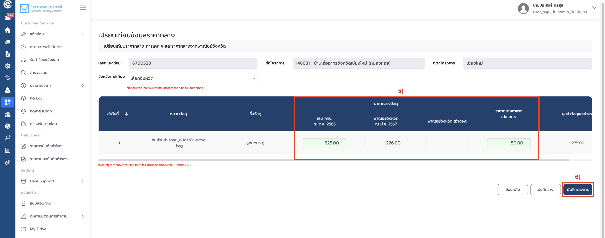<figcaption>
<strong>รูปภาพที่ 38</strong> หน้าจอการประมาณราคา – วิธีการเปรียบเทียบราคากลาง
</figcaption></figure>

<figure>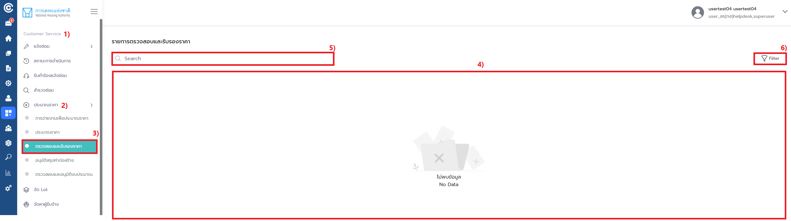<figcaption>
<strong>รูปภาพที่ 39</strong> หน้าจอการประมาณราคา – วิธีการเปรียบเทียบราคากลาง
</figcaption></figure>

#### **2.5.5 ตรวจสอบและรับรองราคา**

**วิธีการดูรายการตรวจสอบและรับรองราคา**

1. ไปที่แอปพลิเคชัน “Customer Service”
2. คลิกเมนู “ประมาณราคา”
3. คลิก “ตรวจสอบและรับรองราคา”
4. ผู้ใช้งานสามารถดูรายการตรวจสอบและรับรองราคาได้ที่ตาราง รายการตรวจสอบและรับรองราคา
5. ผู้ใช้งานสามารถค้นหารายการตรวจสอบและรับรองราคา โดยระบุข้อมูลที่ต้องการค้นหาได้ที่ “ช่องค้นหา”
6. ผู้ใช้งานสามารถใช้ตัวกรอง โดยคลิกปุ่ม “Filter” สามารถกรอง วันที่แจ้งซ่อม ประเภทการแจ้งซ่อม โครงการ ได้

<figure>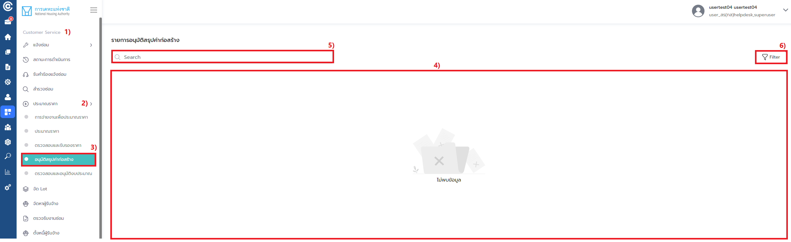<figcaption>
<strong>รูปภาพที่ 40</strong> หน้าจอการตรวจสอบและรับรองราคา – วิธีการดูรายการตรวจสอบและรับรองราคา
</figcaption></figure>

**วิธีการดำเนินการตรวจสอบและรับรองราคา**

1. ไปที่แอปพลิเคชัน “Customer Service”
2. คลิกเมนู “ประมาณราคา”
3. คลิกเมนู “ตรวจสอบและรับรองราคา”
4. ผู้ใช้งานสามารถทำการพิมพ์ใบเอกสารได้โดยการคลิก “ไอคอนดาวน์โหลด”
5. ผู้ใช้งานสามารถแก้ไขการตรวจสอบและรับรองราคาได้โดยคลิกปุ่ม “แก้ไขรายละเอียด” จากนั้นทำการบันทึกข้อมูลที่แก้ไข โดยคลิก “บันทึกข้อมูล”
6. ผู้ใช้งานสามารถทำการส่งอนุมัติรายการตรวจสอบและรับรองราคาได้โดย คลิกปุ่ม “ส่งตรวจสอบและรับรองราคา”

<figure>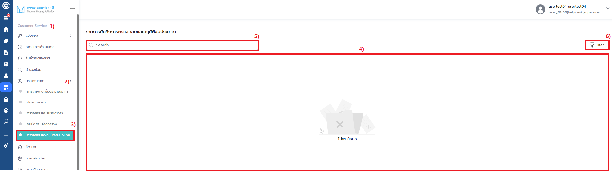<figcaption>
<strong>รูปภาพที่ 41</strong> หน้าจอการตรวจสอบและรับรองราคา – วิธีการดำเนินการตรวจสอบและรับรองราคา
</figcaption></figure>

#### **2.5.6 อนุมัติสรุปค่าก่อสร้าง**

**วิธีการดูรายการอนุมัติสรุปค่าก่อสร้าง**

1. ไปที่แอปพลิเคชัน “Customer Service”
2. คลิกเมนู “ประมาณราคา”
3. คลิก “อนุมัติสรุปค่าก่อสร้าง”
4. ผู้ใช้งานสามารถดูรายการอนุมัติสรุปค่าก่อสร้าง ได้ที่ตาราง รายการอนุมัติสรุปค่าก่อสร้าง
5. ผู้ใช้งานสามารถค้นหารายการอนุมัติสรุปค่าก่อสร้าง โดยระบุข้อมูลที่ต้องการค้นหาได้ที่ “ช่องค้นหา”
6. ผู้ใช้งานสามารถใช้ตัวกรอง โดยคลิกปุ่ม “Filter” สามารถกรอง โครงการ เลขคำร้องแจ้งซ่อม บ้าน/ห้องเลขที่ วันที่แจ้งซ่อม สถานะ ประเภทการแจ้งซ่อม ได้

<figure>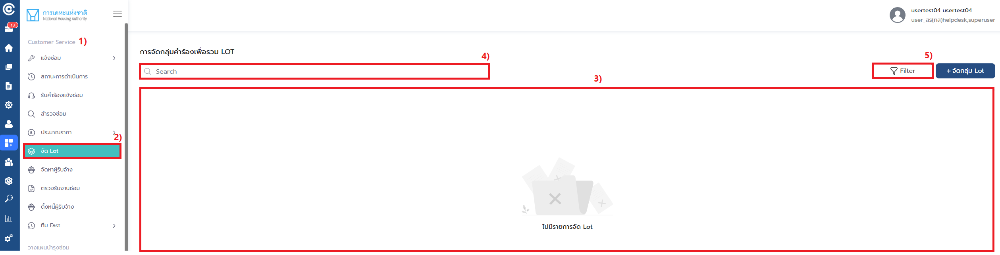<figcaption>
<strong>รูปภาพที่ 42</strong> หน้าจอการอนุมัติสรุปค่าก่อสร้าง – วิธีการดูรายการอนุมัติสรุปค่าก่อสร้าง
</figcaption></figure>
**วิธีการดำเนินการอนุมัติสรุปค่าก่อสร้าง**

1. ไปที่แอปพลิเคชัน “Customer Service”
2. คลิกเมนู “ประเมินราคา”
3. คลิก “ตรวจสอบและรับรองราคา”
4. ผู้ใช้งานสามารถทำการพิมพ์ใบเอกสารได้โดยการคลิก “ไอคอนดาวน์โหลด”
5. ผู้ใช้งานสามารถแก้ไขการอนุมัติสรุปค่าก่อสร้างได้โดยคลิกปุ่ม “ส่งกลับเพื่อแก้ไข”
6. ผู้ใช้งานสามารถทำการอนุมัติสรุปค่าก่อสร้างได้โดย คลิกปุ่ม “บันทึกร่าง”
7. ผู้ใช้งานสามารถทำการส่งต่อการอนุมัติสรุปค่าก่อสร้างได้โดย คลิกปุ่ม “ส่งอนุมัติสรุปค่าก่อสร้าง”

<figure>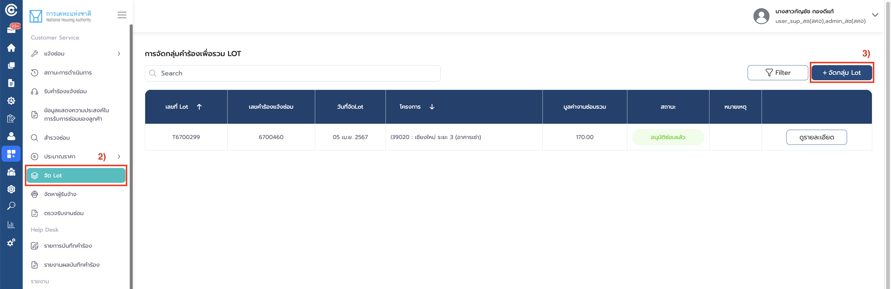<figcaption>
<strong>รูปภาพที่ 43</strong> หน้าจอการตรวจสอบและรับรองราคา – วิธีการดำเนินการอนุมัติสรุปค่าก่อสร้าง
</figcaption></figure>

#### **2.5.7 ตรวจสอบและอนุมัติงบประมาณ**

**วิธีการดูรายการบันทึกการตรวจสอบและอนุมัติงบประมาณ**

1. ไปที่แอปพลิเคชัน “Customer Service”
2. คลิกเมนู “ประมาณราคา”
3. คลิก “ตรวจสอบและอนุมัติงบประมาณ”
4. ผู้ใช้งานสามารถดูรายการบันทึกการตรวจสอบและอนุมัติงบประมาณ ได้ที่ตาราง รายการบันทึกการตรวจสอบและอนุมัติงบประมาณ
5. ผู้ใช้งานสามารถค้นหารายการบันทึกการตรวจสอบและอนุมัติงบประมาณ โดยระบุข้อมูลที่ต้องการค้นหาได้ที่ “ช่องค้นหา”
6. ผู้ใช้งานสามารถใช้ตัวกรอง โดยคลิกปุ่ม “Filter” สามารถกรอง วันที่แจ้งซ่อม ประเภทการแจ้งซ่อม โครงการ ได้

<figure>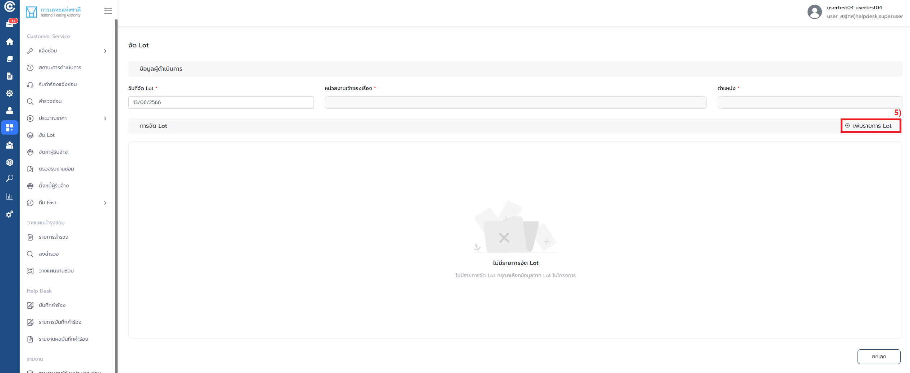<figcaption>
<strong>รูปภาพที่ 44</strong> หน้าจอการตรวจสอบและอนุมัติงบประมาณ – วิธีการดูรายการบันทึกการตรวจสอบและอนุมัติงบประมาณ
</figcaption></figure>

**วิธีการดูรายละเอียดคำร้องรายการบันทึกการตรวจสอบและอนุมัติงบประมาณ**

1. ไปที่แอปพลิเคชัน “Customer Service”
2. คลิกเมนู “ประมาณราคา”
3. คลิก “ตรวจสอบและรับรองราคา”
4. คลิก “ดูรายละเอียดบันทึก” รายการบันทึกการตรวจสอบและอนุมัติงบประมาณที่รออนุมัติงบประมาณ
5. ผู้ใช้งานสามารถทำการพิมพ์ใบเอกสารได้โดยการคลิก “ไอคอนดาวน์โหลด”
6. ผู้ใช้งานสามารถส่งรอจัดสรรงบประมาณ และส่งกลับได้โดยคลิก “รอจัดสรรงบประมาณ และส่งกลับ”
7. ผู้ใช้งานสามารถไม่อนุมัติรายการบันทึกการตรวจสอบได้โดยคลิก “ไม่อนุมัติ”
8. ผู้ใช้งานสามารถอนุมัติงบประมาณได้โดยการ ระบุว่าใช้งบของหน่วยงานไหนและระบุจำนวนงบประมาณที่อนุมัติ และคลิกปุ่ม “ยืนยันการตรวจสอบและอนุมัติงบประมาณ”

<figure>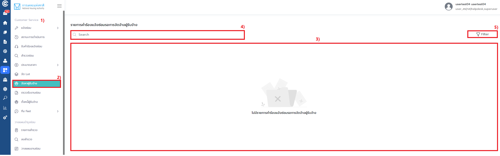<figcaption>
<strong>รูปภาพที่ 45</strong> หน้าจอการตรวจสอบและรับรองราคา – วิธีการดำเนินการอนุมัติสรุปค่าก่อสร้าง
</figcaption></figure>

### 2.6 จัด Lot

ผู้ใช้งานสามารถดูรายละเอียดการจัดกลุ่มคำร้องเพื่อรวม LOT ได้ดังนี้

**วิธีการดูรายละเอียดการจัดกลุ่มคำร้องเพื่อรวม LOT**

1. ไปที่แอปพลิเคชัน “Customer Service”
2. คลิก “จัด LOT”
3. ระบบจะแสดงหน้ารายการการจัดกลุ่มคำร้องเพื่อรวม LOT
4. ผู้ใช้งานสามารถค้นหาการจัดกลุ่มคำร้องเพื่อรวม LOT โดยระบุข้อมูลที่ต้องการค้นหาได้ที่ “ช่องค้นหา”
5. ผู้ใช้งานสามารถใช้ตัวกรอง โดยคลิกปุ่ม “Filter” สามารถกรอง เลขที่ Lot วันที่จัด Lot เลขที่คำร้องแจ้งซ่อม โครงการ มูลค่างานซ่อมรวม สถานะ ได้

<figure>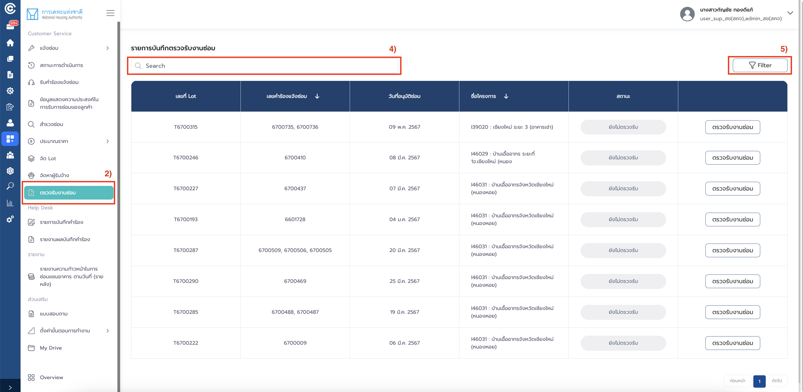<figcaption>
<strong>รูปภาพที่ 46</strong> หน้าจอวางแผนงานซ่อม – วิธีการดูรายละเอียดการจัดกลุ่มคำร้องเพื่อรวม LOT
</figcaption></figure>

**วิธีการเพิ่มการจัดกลุ่มคำร้องเพื่อรวม LOT**

1. ไปที่แอปพลิเคชัน “Customer Service”
2. คลิก “จัด LOT”
3. คลิกปุ่ม “+ จัดกลุ่ม LOT”
4. ระบบแสดงหน้า จัด Lot จากนั้นผู้ใช้งานกรอกข้อมูลผู้ดำเนินการ
5. คลิก “+ เพิ่มรายการ Lot”

<figure>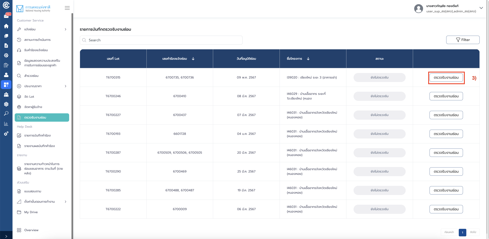<figcaption>
<strong>รูปภาพที่ 47</strong> หน้าจอวางแผนงานซ่อม – วิธีการเพิ่มการจัดกลุ่มคำร้องเพื่อรวม LOT
</figcaption></figure>

<figure>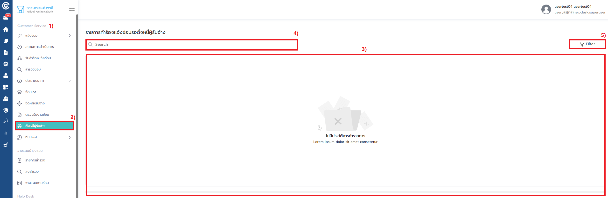<figcaption>
<strong>รูปภาพที่ 48</strong> หน้าจอวางแผนงานซ่อม – วิธีการเพิ่มการจัดกลุ่มคำร้องเพื่อรวม LOT
</figcaption></figure>

### 2.7 จัดหาผู้รับจ้าง

**วิธีการดูรายละเอียดรายการคำร้องแจ้งซ่อมรอการจัดจ้างผู้รับจ้าง**

1. ไปที่แอปพลิเคชัน “Customer Service”
2. คลิก “จัดหาผู้รับจ้าง”
3. ระบบจะแสดงหน้ารายการคำร้องแจ้งซ่อมรอการจัดจ้างผู้รับจ้าง
4. ผู้ใช้งานสามารถค้นหารายการคำร้องแจ้งซ่อมรอการจัดจ้างผู้รับจ้าง โดยระบุข้อมูลที่ต้องการค้นหาได้ที่ “ช่องค้นหา”
5. ผู้ใช้งานสามารถใช้ตัวกรอง โดยคลิกปุ่ม “Filter” สามารถกรอง เลขคำร้องแจ้งซ่อม วันที่แจ้งซ่อม ประเภทการแจ้งซ่อม โครงการ บ้าน/ห้องเลขที่ สถานะ ได้

<figure>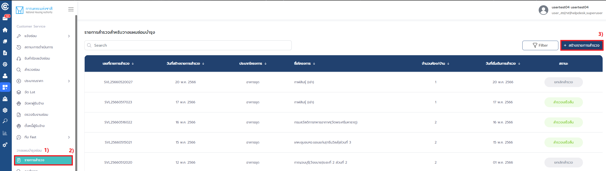<figcaption>
<strong>รูปภาพที่ 49</strong> หน้าจอจัดหาผู้รับจ้าง – วิธีการดูรายละเอียดรายการคำร้องแจ้งซ่อมรอการจัดจ้างผู้รับจ้าง
</figcaption></figure>

### 2.8 ตรวจรับงานซ่อม

**วิธีการดูรายละเอียดรายการบันทึกตรวจรับงานซ่อม**

1. ไปที่แอปพลิเคชัน “Customer Service”
2. คลิก “ตรวจรับงานซ่อม”
3. ระบบจะแสดงหน้า รายการบันทึกตรวจรับงานซ่อม
4. ผู้ใช้งานสามารถค้นหารายการบันทึกตรวจรับงานซ่อม โดยระบุข้อมูลที่ต้องการค้นหาได้ที่ “ช่องค้นหา”
5. ผู้ใช้งานสามารถใช้ตัวกรอง โดยคลิกปุ่ม “Filter” สามารถกรอง เลขคำร้องแจ้งซ่อม วันที่แจ้งซ่อม ประเภทการแจ้งซ่อม โครงการ บ้าน/ห้องเลขที่ สถานะ ได้

<figure>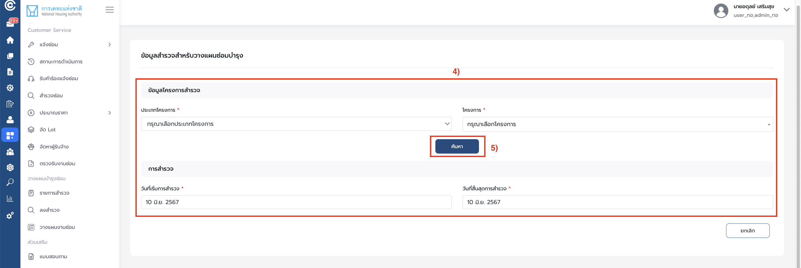<figcaption>
<strong>รูปภาพที่ 50</strong> หน้าจอตรวจรับงานซ่อม – วิธีการดูรายละเอียดรายการบันทึกตรวจรับงานซ่อม
</figcaption></figure>

**วิธีการตรวจรับงานซ่อม**

1. ไปที่แอปพลิเคชัน “Customer Service”
2. คลิก “ตรวจรับงานซ่อม”
3. ระบบจะแสดงหน้า รายการบันทึกตรวจรับงานซ่อม คลิก “ตรวจรับงานซ่อม”

<figure>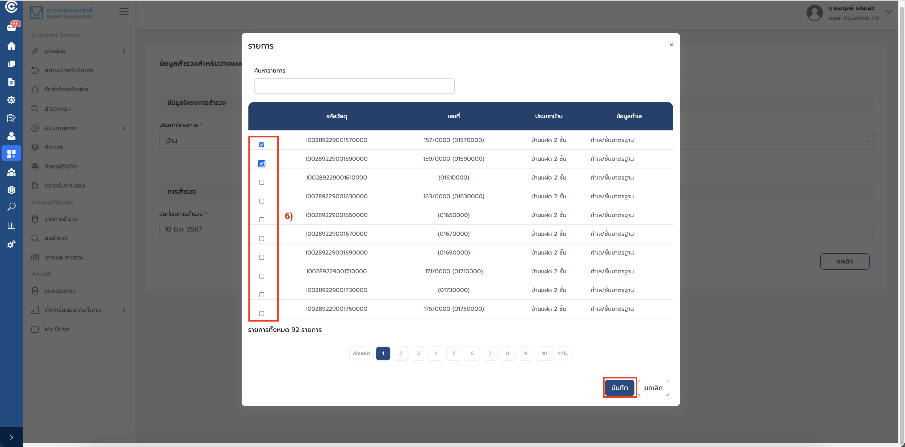<figcaption>
<strong>รูปภาพที่ 51</strong> หน้าจอตรวจรับงานซ่อม – วิธีการตรวจรับงานซ่อม
</figcaption></figure>

### 2.9 ตั้งหนี้ผู้รับจ้าง

**วิธีการดูรายละเอียดรายการคำร้องแจ้งซ่อมรอตั้งหนี้ผู้รับจ้าง**

1. ไปที่แอปพลิเคชัน “Customer Service”
2. คลิก “ตั้งหนี้ผู้รับจ้าง”
3. ระบบจะแสดงหน้ารายการคำร้องแจ้งซ่อมรอตั้งหนี้ผู้รับจ้าง
4. ผู้ใช้งานสามารถค้นหารายการคำร้องแจ้งซ่อมรอตั้งหนี้ผู้รับจ้าง โดยระบุข้อมูลที่ต้องการค้นหาได้ที่ “ช่องค้นหา”
5. ผู้ใช้งานสามารถใช้ตัวกรอง โดยคลิกปุ่ม “Filter” สามารถกรอง เลขคำร้องแจ้งซ่อม วันที่แจ้งซ่อม ประเภทการแจ้งซ่อม โครงการ บ้าน/ห้องเลขที่ สถานะ ได้

<figure>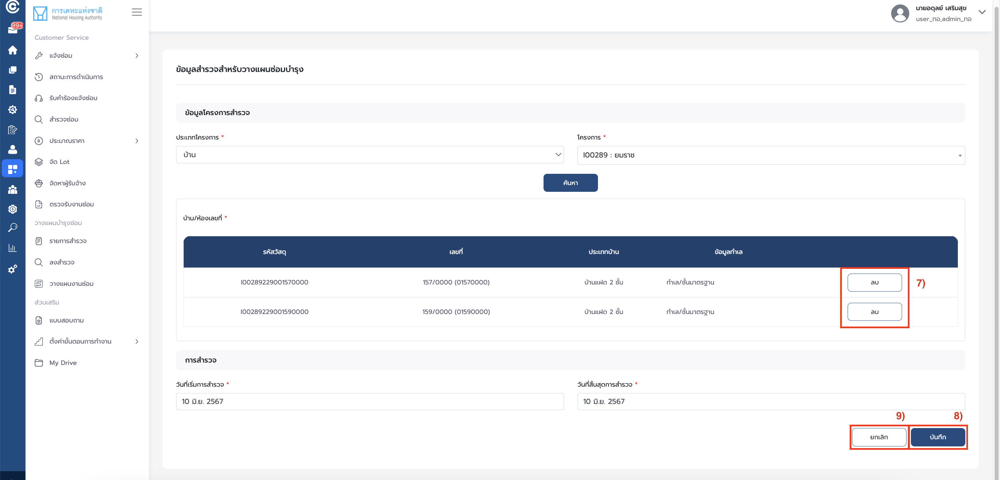<figcaption>
<strong>รูปภาพที่ 52</strong> หน้าจอตั้งหนี้ผู้รับจ้าง – วิธีการดูรายละเอียดรายการคำร้องแจ้งซ่อมรอตั้งหนี้ผู้รับจ้าง
</figcaption></figure>

### 2.10 ทีม Fast

ผู้ใช้งานสามารถดูรายงาน และส่งผลรายงานทีม Fast ได้ดังนี้

#### **2.10.1 รายงานผลทีม Fast**

**วิธีการรายงานทีม Fast**

1. ไปที่แอปพลิเคชัน “Customer Service”
2. คลิก “ทีม Fast”

#### **2.10.2 ส่งรายงานผลทีม Fast**

**วิธีการส่งรายงานผลทีม Fast**

1. ไปที่แอปพลิเคชัน “Customer Service”
2. คลิก “ทีม Fast”
3. คลิก “รายงานผลทีม Fast”
4. ผู้ใช้งานสามารถรายงานส่งทีม Fast โดยคลิกปุ่ม “ส่งผลรายงาน”
5. ผู้ใช้งานเจ้าหน้าที่สามารถพิมพ์รายงานได้ โดยการคลิกปุ่ม “พิมพ์รายงาน”
6. ผู้ใช้งานเจ้าหน้าที่สามารถส่งผลรายงานได้ โดยการคลิกปุ่ม “ส่งผล”

## **บทที่ 3 การใช้งานในส่วนของเมนู วางแผนบำรุงซ่อม**

ผู้ใช้งานสามารถดูรายการสำรวจ ดูรายการลงสำรวจ วางแผนงานซ่อมได้

### 3.1 รายการสำรวจ

ผู้ใช้งานสามารถการสร้างรายการสำรวจ และดูรายละเอียดรายการสำรวจ

#### **วิธีการสร้างรายการสำรวจสำหรับวางแผนซ่อมบำรุง**

1. ไปที่เมนู “วางแผนบำรุงซ่อม”
2. คลิก “รายการสำรวจ”
3. คลิกปุ่ม “+ สร้างรายการสำรวจ”
4. ระบบแสดงหน้า ข้อมูลสำรวจสำหรับวางแผนซ่อมบำรุง จากนั้นผู้ใช้งานกรอกข้อมูล โครงการสำรวจ วันที่เริ่ม-สิ้นสุดการสำรวจ
5. จากนั้นทำการค้นหาข้อมูลโครงการที่ต้องการสำรวจ โดยคลิกปุ่ม “ค้นหา”
6. ผู้ใช้งานคลิกเลือกรายการสำรวจที่ต้องการ จากนั้นคลิกปุ่ม “บันทึก” โดยผู้ใช้งานสามารถคลิก “ค้นหา” อีกครั้ง เพื่อเลือกรายการสำรวจเพิ่มได้
7. ผู้ใช้งานสามารถทำการลบรายการสำรวจที่เลือกได้ โดยคลิกปุ่ม “ลบ”
8. เมื่อผู้ใช้งานกรอกข้อมูลและเลือกรายการสำรวจเรียบร้อยแล้ว คลิกปุ่ม “บันทึก” เพื่อสร้างรายการสำรวจ
9. ถ้าต้องการยกเลิกการสร้างรายการสำรวจ คลิกปุ่ม “ยกเลิก”

<figure>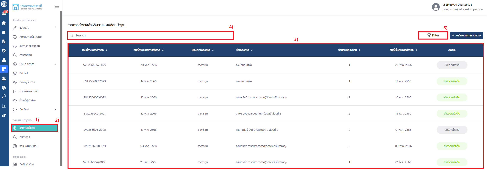<figcaption>
<strong>รูปภาพที่ 53</strong> หน้าจอรายการสำรวจ – วิธีการสร้างรายการสำรวจ

</figcaption></figure>

<figure>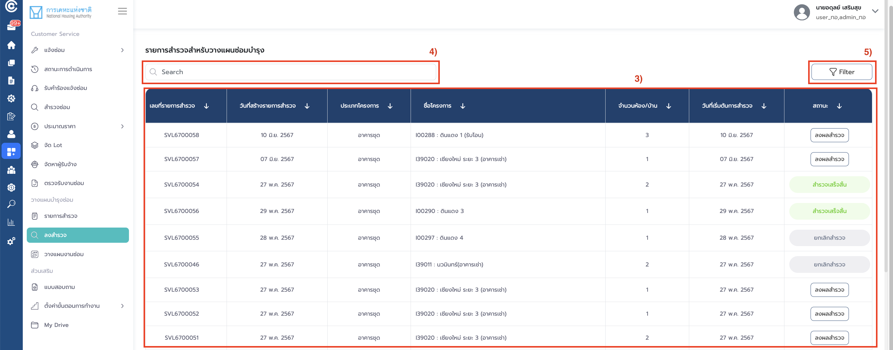<figcaption>
<strong>รูปภาพที่ 54</strong> หน้าจอรายการสำรวจ – วิธีการสร้างรายการสำรวจสำหรับวางแผนซ่อมบำรุง
</figcaption></figure>

<figure>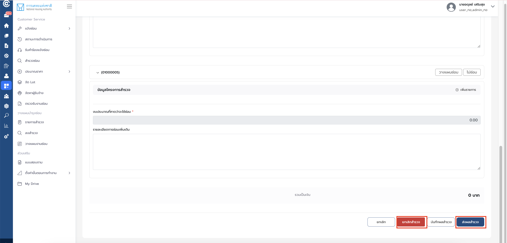<figcaption>
<strong>รูปภาพที่ 55</strong> หน้าจอรายการสำรวจ – วิธีการสร้างรายการสำรวจสำหรับวางแผนซ่อมบำรุง
</figcaption></figure>

<figure>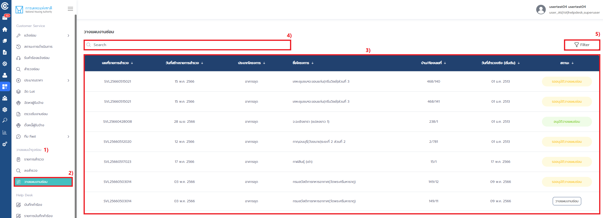<figcaption>
<strong>รูปภาพที่ 56</strong> หน้าจอรายการสำรวจ – วิธีการสร้างรายการสำรวจสำหรับวางแผนซ่อมบำรุง
</figcaption></figure>

#### **วิธีการดูรายละเอียดรายการสำรวจสำหรับวางแผนซ่อมบำรุง**

1. ไปที่เมนู “วางแผนบำรุงซ่อม”
2. คลิก “รายการสำรวจ”
3. ระบบจะแสดงหน้ารายการสำรวจสำหรับวางแผนซ่อมบำรุง
4. ผู้ใช้งานสามารถค้นหารายการสำรวจสำหรับวางแผนซ่อมบำรุง โดยระบุข้อมูลที่ต้องการค้นหาได้ที่ “ช่องค้นหา”
5. ผู้ใช้งานสามารถใช้ตัวกรอง โดยคลิกปุ่ม “Filter” สามารถกรอง ปีที่สร้างรายการสำรวจ เลขที่รายการสำรวจ วันที่เริ่มต้นการสำรวจ วันที่สิ้นสุดการสำรวจ ประเภทโครงการ สถานะ ได้
6. เมื่อผู้ใช้งานคลิกรายการสำรวจสำหรับวางแผนซ่อมบำรุง ระบบจะแสดงรายละเอียดทั้งหมดของรายการสำรวจ

<figure>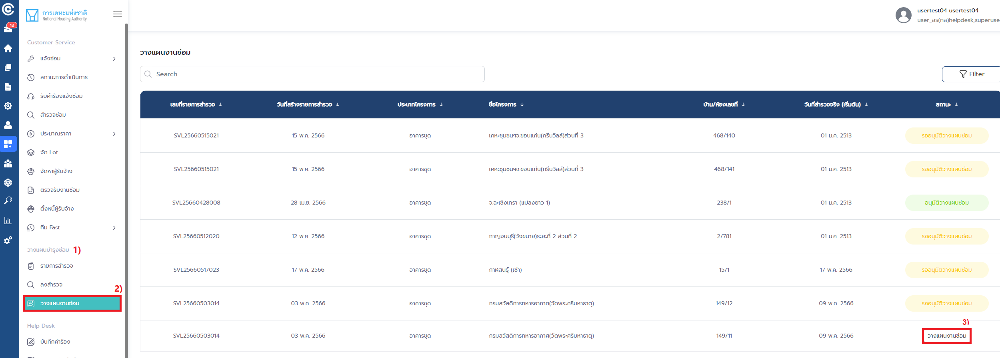<figcaption>
<strong>รูปภาพที่ 57</strong> หน้าจอรายการสำรวจ – วิธีการดูรายละเอียดรายการสำรวจสำหรับวางแผนซ่อมบำรุง
</figcaption></figure>

### 3.2 ลงสำรวจ

ผู้ใช้งานสามารถดูรายละเอียดรายการสำรวจสำหรับวางแผนซ่อมบำรุงได้

#### **วิธีการดูรายละเอียดรายการสำรวจสำหรับวางแผนซ่อมบำรุง**

1. ไปที่เมนู “วางแผนบำรุงซ่อม”
2. คลิก “ลงสำรวจ”
3. ระบบจะแสดงหน้ารายการสำรวจสำหรับวางแผนซ่อมบำรุง
4. ผู้ใช้งานสามารถค้นหารายการสำรวจสำหรับวางแผนซ่อมบำรุง โดยระบุข้อมูลที่ต้องการค้นหาได้ที่ “ช่องค้นหา”
5. ผู้ใช้งานสามารถใช้ตัวกรอง โดยคลิกปุ่ม “Filter” สามารถกรอง ปีที่สร้างรายการสำรวจ เลขที่รายการสำรวจ วันที่เริ่มต้นการสำรวจ วันที่สิ้นสุดการสำรวจ ประเภทโครงการ สถานะ ได้
6. เมื่อผู้ใช้งานคลิกรายการสำรวจสำหรับวางแผนซ่อมบำรุง ระบบจะแสดงรายละเอียดของรายการนั้น

<figure>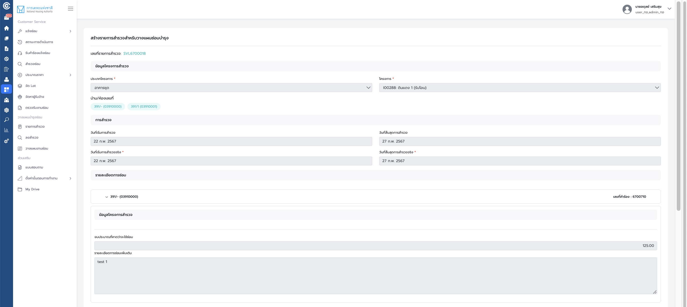<figcaption>
<strong>รูปภาพที่ 58</strong> หน้าจอรายการสำรวจ – วิธีการดูรายละเอียดรายการสำรวจสำหรับวางแผนซ่อมบำรุง
</figcaption></figure>

#### **วิธีการลงผลสำรวจสำหรับวางแผนซ่อมบำรุง**

1. ไปที่เมนู “วางแผนบำรุงซ่อม”
2. คลิก “ลงสำรวจ”
3. ระบบจะแสดงหน้ารายการสำรวจสำหรับวางแผนซ่อมบำรุง
4. ผู้ใช้งานสามารถลงผลสำรวจสำหรับรายการวางแผนซ่อมบำรุง โดยคลิก “ลงผลสำรวจ”
5. ผู้ใช้งานสามารถเลือกกำหนด “วางแผนซ่อม” หรือ “ไม่ซ่อม” ตามรายการสรุปผลการสำรวจ
6. เมื่อผู้ใช้งานกรอกผลสำรวจรายการวางแผนซ่อมบำรุงเรียบร้อย สามารถส่งผลสำรวจ โดยคลิก “ส่งผลสำรวจ”
7. ผู้ใช้งานสามารถทำการยกเลิกรายการวางแผนซ่อมบำรุงได้ โดยคลิก “ยกเลิกสำรวจ”

### 3.3 วางแผนงานซ่อม

ผู้ใช้งานสามารถดูรายละเอียดการวางแผนงานซ่อมได้ดังนี้

**วิธีการดูรายละเอียดรายการสำรวจสำหรับวางแผนงานซ่อม**

1. ไปที่เมนู “วางแผนบำรุงซ่อม”
2. คลิก “วางแผนงานซ่อม”
3. ระบบจะแสดงหน้ารายการวางแผนงานซ่อม
4. ผู้ใช้งานสามารถค้นหารายการวางแผนงานซ่อม โดยระบุข้อมูลที่ต้องการค้นหาได้ที่ “ช่องค้นหา”
5. ผู้ใช้งานสามารถใช้ตัวกรอง โดยคลิกปุ่ม “Filter” สามารถกรอง ปีที่สร้างรายการสำรวจ เลขที่รายการสำรวจ วันที่เริ่มต้นการสำรวจ วันที่สิ้นสุดการสำรวจ ประเภทโครงการ สถานะ ได้
6. เมื่อผู้ใช้งานคลิก “รายการวางแผนงานซ่อม” หรือ คลิก “ดูรายละเอียด” ระบบจะแสดงรายการวางแผนงานซ่อม

<figure>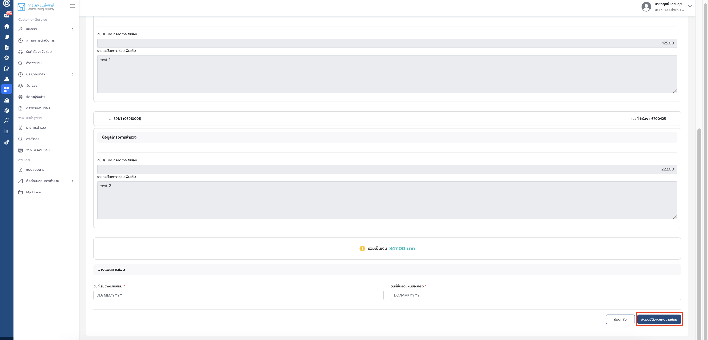<figcaption>
<strong>รูปภาพที่ 59/strong> หน้าจอวางแผนงานซ่อม – วิธีการดูรายละเอียดรายการสำรวจสำหรับวางแผนงานซ่อม
</figcaption></figure>

**วิธีการสร้างรายการสำรวจสำหรับวางแผนซ่อมบำรุง**

1. ไปที่เมนู “วางแผนซ่อมบำรุง”
2. คลิก “วางแผนงานซ่อม”
3. คลิกปุ่ม “วางแผนงานซ่อม”
4. ระบบแสดงหน้า สร้างรายการสำรวจสำหรับวางแผนซ่อมบำรุง จากนั้นผู้ใช้งานกรอกข้อมูล
5. เมื่อผู้ใช้งานกรอกข้อมูลเรียบร้อยแล้ว คลิกปุ่ม “ส่งอนุมัติวางแผนงานซ่อม”

<figure>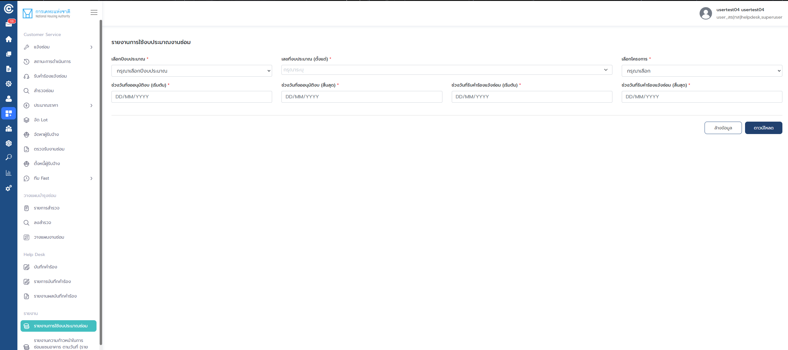<figcaption>
<strong>รูปภาพที่ 60</strong> หน้าจอวางแผนงานซ่อม – วิธีการสร้างรายการสำรวจสำหรับวางแผนซ่อมบำรุง
</figcaption></figure>

<figure>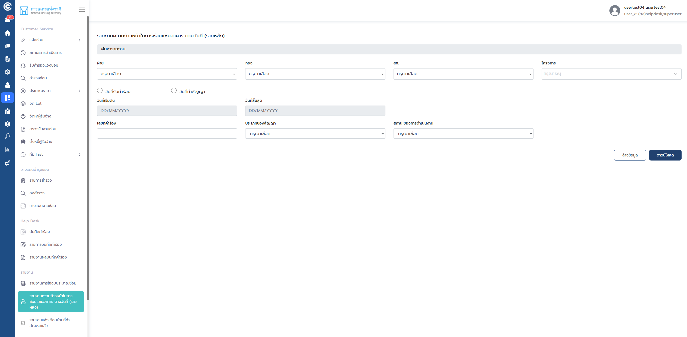<figcaption>
<strong>รูปภาพที่ 61</strong> หน้าจอวางแผนงานซ่อม – ฟอร์มสร้างรายการสำรวจสำหรับวางแผนซ่อมบำรุง (1)
</figcaption></figure>

<figure>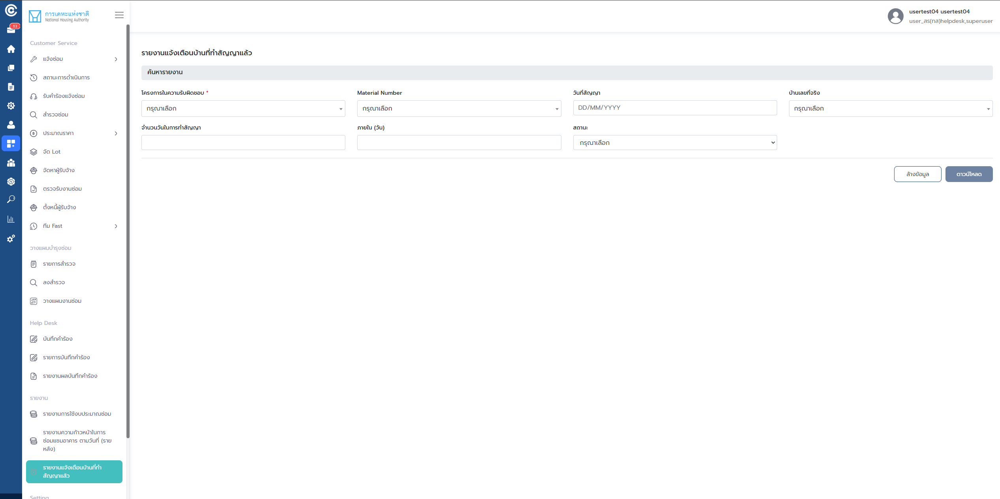<figcaption>
<strong>รูปภาพที่ 62</strong> หน้าจอวางแผนงานซ่อม – ฟอร์มสร้างรายการสำรวจสำหรับวางแผนซ่อมบำรุง (2)
</figcaption></figure>

## **บทที่ 4 การใช้งานในส่วนของเมนู รายงาน**

### 4.1 รายงานการใช้งบประมาณซ่อม

#### **วิธีการออกรายงานการใช้งบประมาณซ่อม**

1. ไปที่เมนู “รายงาน”
2. คลิก “รายงานการใช้งบประมาณซ่อม”
3. ผู้ใช้งานสามารถเลือกข้อมูลที่ต้องการออกรายงานได้
4. คลิกปุ่ม “ดาวน์โหลด”
5. ผู้ใช้งานสามารถล้างข้อมูลได้โดยการ คลิกปุ่ม “ล้างข้อมูล”

<figure><figcaption>
<strong>รูปภาพที่ 63</strong> หน้าจอรายงาน – วิธีการออกรายงานการใช้งบประมาณซ่อม
</figcaption></figure>

### 4.2 รายงานความก้าวหน้าในการซ่อมแซมอาคาร ตามวันที่ (รายหลัง)

#### **วิธีการออกรายงานความก้าวหน้าในการซ่อมแซมอาคาร ตามวันที่ (รายหลัง)**

1. ไปที่เมนู “รายงาน”
2. คลิก “รายงานความก้าวหน้าในการซ่อมแซมอาคาร ตามวันที่ (รายหลัง)”
3. ผู้ใช้งานสามารถเลือกข้อมูลที่ต้องการออกรายงานได้
4. คลิกปุ่ม “ดาวน์โหลด”
5. ผู้ใช้งานสามารถล้างข้อมูลได้โดยการ คลิกปุ่ม “ล้างข้อมูล”

<figure>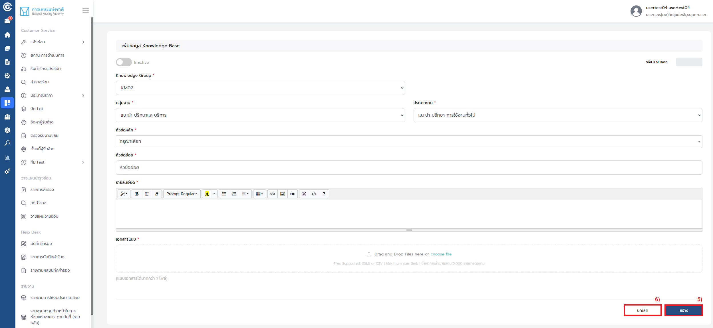<figcaption>
<strong>รูปภาพที่ 64</strong> หน้าจอรายงาน – วิธีการออกรายงานความก้าวหน้าในการซ่อมแซมอาคาร ตามวันที่ (รายหลัง)
</figcaption></figure>

### 4.3 รายงานแจ้งเตือนบ้านที่ทำสัญญาแล้ว

#### **วิธีการออกรายงานแจ้งเตือนบ้านที่ทำสัญญาแล้ว**

1. ไปที่เมนู “รายงาน”
2. คลิก “รายงานแจ้งเตือนบ้านที่ทำสัญญาแล้ว”
3. ผู้ใช้งานสามารถเลือกข้อมูลที่ต้องการออกรายงานได้
4. คลิกปุ่ม “ดาวน์โหลด”
5. ผู้ใช้งานสามารถล้างข้อมูลได้โดยการ คลิกปุ่ม “ล้างข้อมูล”

<figure>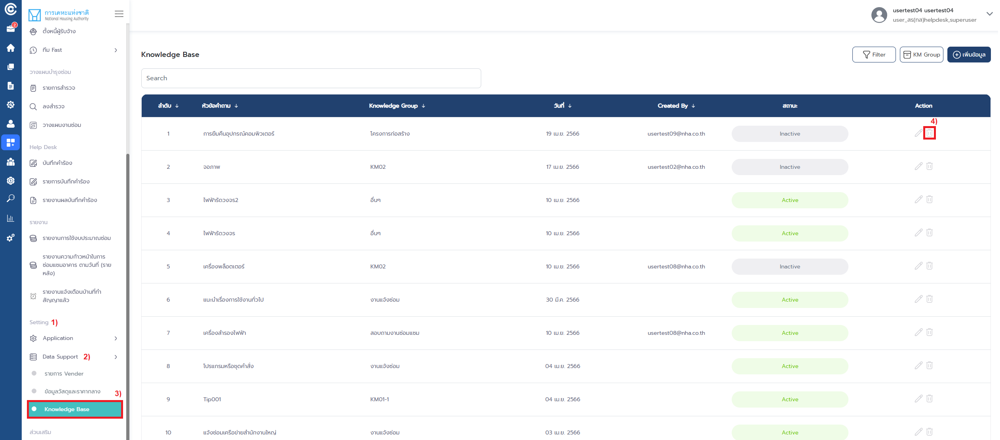<figcaption>
<strong>รูปภาพที่ 65</strong> sน้าจอรายงาน – วิธีการออกรายงานแจ้งเตือนบ้านที่ทำสัญญาแล้ว
</figcaption></figure>

## **บทที่ 5 การใช้งานในส่วนของเมนู Setting**

ผู้ใช้งานสามารถตั้งค่า Data Support โดยจะต้องมีสิทธิ์เป็นผู้ดูแล จึงจะสามารถทำการตั้งค่าได้

### 5.1 Application 

**5.1.1 Notification**

**วิธีการใช้งาน Notification**

1. ไปที่เมนู “Setting”
2. คลิกเมนู “Data Support”

### 5.2 Data Support

ผู้ใช้งานสามารถตั้งค่า Knowledge Base ได้ดังนี้

**5.2.1 รายการ Vender**

**5.2.2 ข้อมูลวัสดุและราคากลาง**

**5.2.3 Knowledge Base**

#### **วิธีการเพิ่ม Knowledge Base**

1. ไปที่เมนู “Setting”
2. คลิกเมนู “Data Support ”
3. คลิก “Knowledge Base”
4. คลิกปุ่ม “+เพิ่มข้อมูล”
5. ผู้ใช้งานกรอกข้อมูล Knowledge Base จากนั้นคลิกปุ่ม “สร้าง”
   * ระบบแสดงหน้าป๊อบอัพยืนยันการสร้าง Knowledge Base เมื่อคลิกปุ่ม “ยืนยัน”
   * ระบบทำการบันทึกรายการ Knowledge และส่งข้อมูลไปยังหน้า "รายการ Knowledge Base"
   * ระบบแสดงแสดงหน้าป๊อบอัพ เพิ่มข้อมูลสำเร็จ
6. ถ้าต้องการยกเลิกการเพิ่มข้อมูล Knowledge Base คลิกปุ่ม “ยกเลิก”

<figure><figcaption>
<strong>รูปภาพที่ 66</strong> หน้าจอ Knowledge Base – วิธีการเพิ่มข้อมูล Knowledge Base
</figcaption></figure>

<figure>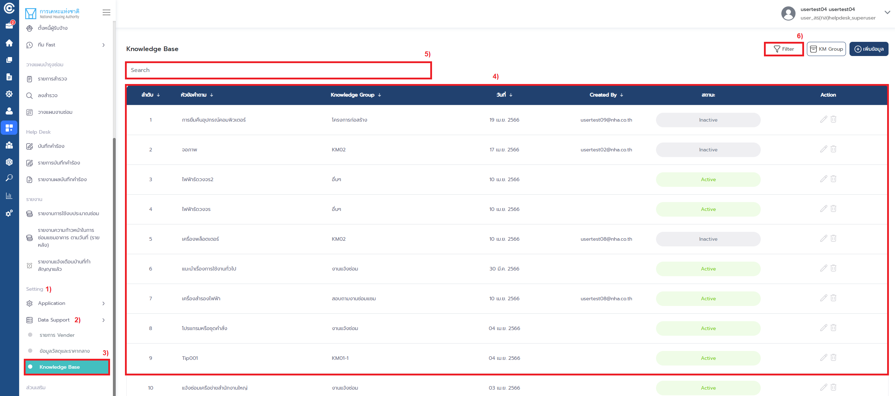<figcaption>
<strong>รูปภาพที่ 67</strong> หน้าจอ Knowledge Base – วิธีการเพิ่มข้อมูล Knowledge Base
</figcaption></figure>

#### **วิธีการลบข้อมูล Knowledge Base**

1. ไปที่เมนู “Setting”
2. คลิกเมนู “Data Support”
3. คลิก “Knowledge Base”
4. ผู้ใช้งานสามารถลบ Knowledge Base ได้ โดยคลิกที่ “ไอคอนถังขยะ”

<figure>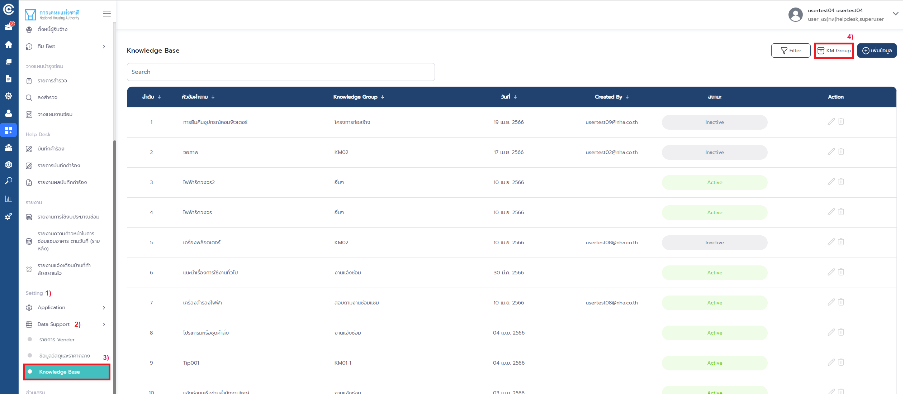<figcaption>
<strong>รูปภาพที่ 68</strong> หน้าจอ Knowledge Base – วิธีการลบข้อมูล Knowledge Base
</figcaption></figure>

#### **วิธีการแก้ไขข้อมูล Knowledge Base**

1. ไปที่เมนู “Setting”
2. คลิกเมนู “Data Support”
3. คลิก “Knowledge Base”
4. ผู้ใช้งานสามารถแก้ไข Knowledge Base ได้ โดยคลิกที่ “ไอคอนดินสอ”

<figure>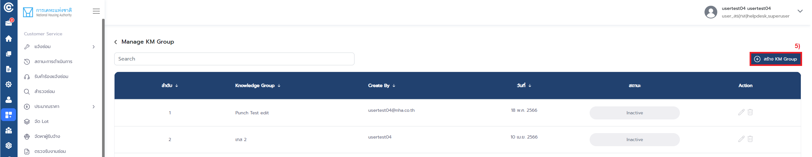<figcaption>
<strong>รูปภาพที่ 69</strong> หน้าจอ Knowledge Base – วิธีการแก้ไขข้อมูล Knowledge Base

</figcaption></figure>

#### **วิธีการดูรายละเอียด Knowledge Base**

1. ไปที่เมนู “Setting”
2. คลิกเมนู “Data Support”
3. คลิก “Knowledge Base”
4. ผู้ใช้งานสามารถดูรายการ Knowledge Base ได้ที่ตาราง Knowledge Base
5. ผู้ใช้งานสามารถค้นหา Knowledge Base ได้ โดยระบุข้อมูลใน “ช่องค้นหา”
6. ผู้ใช้งานสามารถใช้ตัวกรอง โดยคลิกปุ่ม “Filter” สามารถกรอง เรียงตาม Knowledge base Group และสถานะได้

<figure>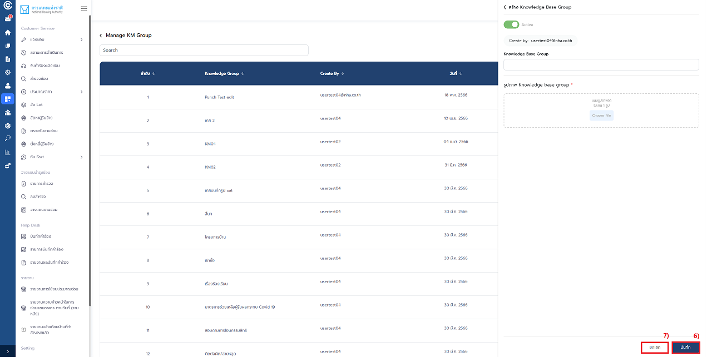<figcaption>
<strong>รูปภาพที่ 70</strong> หน้าจอสำหรับแสดงรายการ Knowledge Base – วิธีการดูรายละเอียดข้อมูล Knowledge Base
</figcaption></figure>

#### **วิธีการเพิ่ม KM Group**

1. ไปที่เมนู “Setting”
2. คลิกเมนู “Data Support”
3. คลิก “Knowledge Base”
4. คลิกปุ่ม “KM Group”
5. ระบบแสดงหน้า Manage KM Group คลิกปุ่ม “สร้าง KM Group”
6. ผู้ใช้งานกรอกข้อมูล Knowledge Base Group จากนั้นคลิกปุ่ม “บันทึก”
   * ระบบแสดงหน้าป๊อบอัพยืนยันการสร้าง Knowledge Base Group เมื่อคลิกปุ่ม “ยืนยัน”
   * ระบบทำการบันทึกรายการ Knowledge และส่งข้อมูลไปยังหน้า "รายการ Knowledge Group"
   * ระบบแสดงแสดงหน้าป๊อบอัพ เพิ่มข้อมูลสำเร็จ
   * ระบบส่งรายการดำเนินการไปรอพิจารณาอนุมัติ
7. ถ้าต้องการยกเลิกการเพิ่มข้อมูล KM Group คลิกปุ่ม “ยกเลิก”

<figure>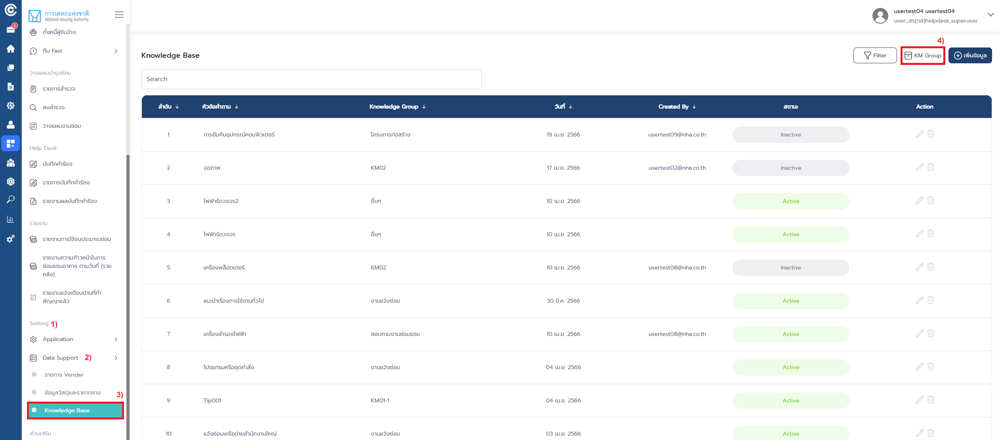<figcaption>
<strong>รูปภาพที่ 71</strong> หน้าจอสำหรับแสดงรายการ KM Group – วิธีการเพิ่มข้อมูล KM Group
</figcaption></figure>

<figure>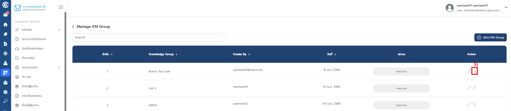<figcaption>
<strong>รูปภาพที่ 72</strong> หน้าจอสำหรับแสดงรายการ KM Group – วิธีการเพิ่มข้อมูล KM Group
</figcaption></figure>

<figure>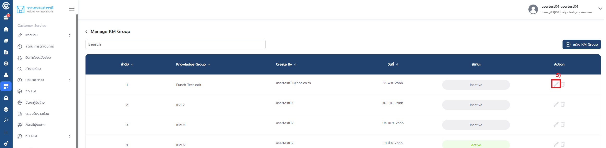<figcaption>
<strong>รูปภาพที่ 73</strong> หน้าจอสำหรับแสดงรายการ KM Group – วิธีการเพิ่มข้อมูล KM Group
</figcaption></figure>

#### **วิธีการลบข้อมูล KM Group**

1. ไปที่เมนู “Setting”
2. คลิกเมนู “Data Support”
3. คลิก “Knowledge Base”
4. คลิกปุ่ม “KM Group”
5. ผู้ใช้งานสามารถลบ KM Group ได้ โดยคลิกที่ “ไอคอนถังขยะ”

<figure>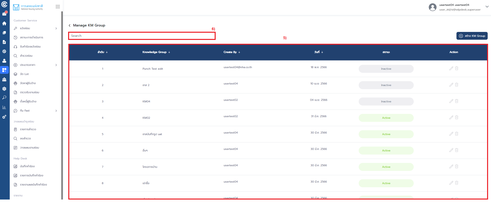<figcaption>
<strong>รูปภาพที่ 74</strong> หน้าจอสำหรับแสดงรายการ KM Group – วิธีการลบข้อมูล KM Group
</figcaption></figure>

#### **วิธีการแก้ไขข้อมูล KM Group**

1. ไปที่เมนู “Setting”
2. คลิกเมนู “Data Support”
3. คลิก “Knowledge Base”
4. คลิกปุ่ม “KM Group”
5. ผู้ใช้งานสามารถแก้ไข KM Group ได้ โดยคลิกที่ “ไอคอนดินสอ”

<figure>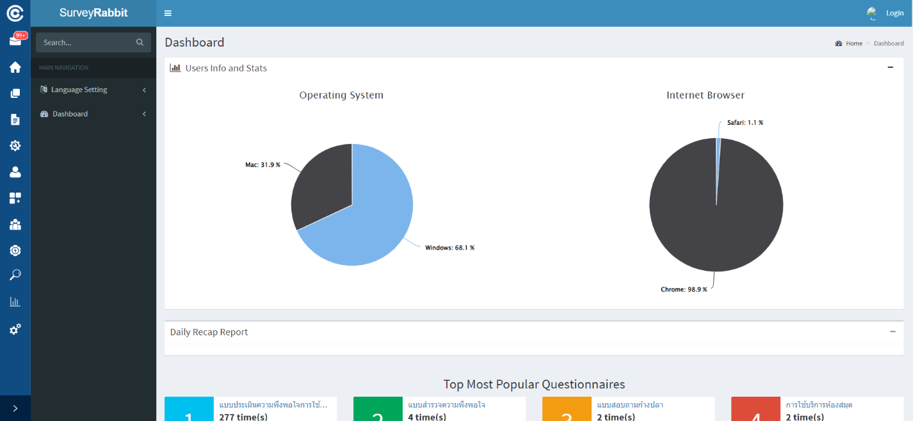<figcaption>
<strong>รูปภาพที่ 75</strong> หน้าจอสำหรับแสดงรายการ KM Group – วิธีการแก้ไขข้อมูล KM Group
</figcaption></figure>

#### **วิธีการดูรายละเอียด KM Group**

1. ไปที่เมนู “Setting”
2. คลิกเมนู “Data Support”
3. คลิก “Knowledge Base”
4. คลิกปุ่ม “KM Group”
5. ผู้ใช้งานสามารถดูรายการ Knowledge Base Group ได้ที่ตาราง Manage KM Group
6. ผู้ใช้งานสามารถค้นหา Knowledge Base Group ได้ โดยระบุข้อมูลใน “ช่องค้นหา”

<figure>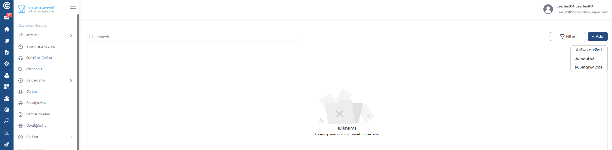<figcaption>
<strong>รูปภาพที่ 76</strong> หน้าจอสำหรับแสดงรายการ KM Group – วิธีการดูรายละเอียดข้อมูล KM Group
</figcaption></figure>

## **บทที่ 6 การใช้งานในส่วนของเมนู ส่วนเสริม**

### 6.1 แบบสอบถาม

#### **วิธีการเข้าใช้งานแบบสอบถาม**

1. ไปที่เมนู “ส่วนเสริม”
2. คลิก “แบบสอบถาม”

<figure><figcaption>
<strong>รูปภาพที่ 77</strong> หน้าจอการใช้งานในส่วนของส่วนเสริม – แบบสอบถาม
</figcaption></figure>

### 6.2 ตั้งค่าขั้นตอนการทำงาน

#### **วิธีการเข้าใช้งานตั้งค่าขั้นตอนการทำงาน**

1. ไปที่เมนู “ส่วนเสริม”
2. ผู้ใช้งานสามารถสร้างขั้นตอนการทำงานได้โดยคลิกเมนู “ตั้งค่าขั้นตอนการทำงาน”
3. ผู้ใช้งานสามารถออกแบบขั้นตอนการทำงาน ได้คลิกเมนู “ออกแบบขั้นตอนการทำงาน”
4. ผู้ใช้งานสามารถเพิ่มฟอร์ม ได้คลิกเมนู “ฟอร์ม”
5. ผู้ใช้งานสามารถเพิ่มเงื่อนไข ได้คลิกเมนู “เงื่อนไข”

<figure>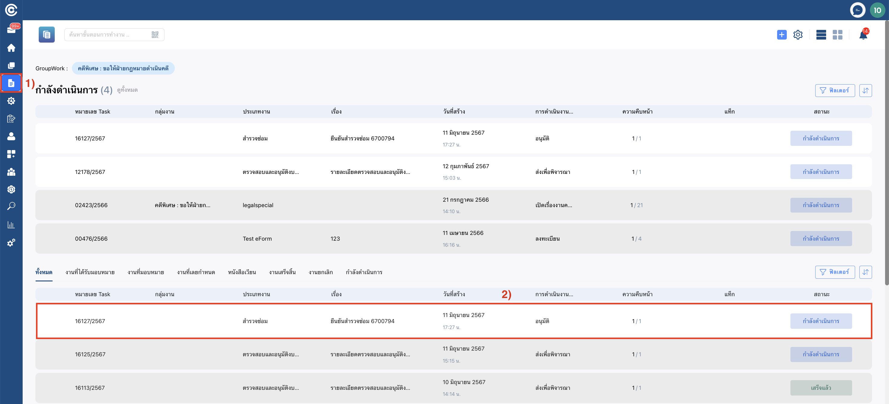<figcaption>
<strong>รูปภาพที่ 78</strong> หน้าจอการใช้งานในส่วนของส่วนเสริม – วิธีการตั้งค่าขั้นตอนการทำงาน
</figcaption></figure>

### 6.3 My Drive

**วิธีการเข้าใช้งาน My Drive**

1. ไปที่เมนู “ส่วนเสริม”
2. คลิกเมนู “My Drive”
3. ผู้ใช้งานสามารถทำการสร้างหรือเพิ่มโฟลเดอร์ใหม่ได้โดยการ คลิก “+Add” เลือก “เพิ่มโฟลเดอร์ใหม่”
4. ผู้ใช้งานทำการระบุชื่อโฟลเดอร์ จากนั้นคลิก “สร้าง”
5. ผู้ใช้งานสามารถทำการอัปโหลดไฟล์ลงใน My Drive ได้โดยการ คลิก “+Add” เลือก “อัปโหลดไฟล์”
6. ผู้ใช้งานทำการอัปโหลดไฟล์หรือรูปภาพและทำการคลิก “อัปโหลด”
7. ผู้ใช้งานสามารถทำการอัปโหลดโฟลเดอร์ลงใน My Drive ได้โดยการ คลิก “+Add” เลือก “อัปโหลดโฟลเดอร์”
8. ผู้ใช้งานทำการเลือกอัปโหลดโฟลเดอร์ที่ต้องการและคลิก “อัปโหลด”

<figure>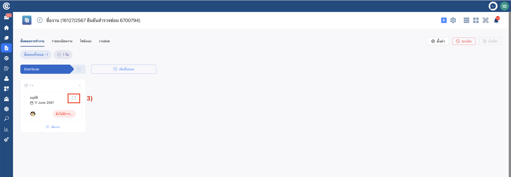<figcaption>
<strong>รูปภาพที่ 79</strong> หน้าจอการใช้งานในส่วนของส่วนเสริม – วิธีการใช้งาน My Drive
</figcaption></figure>

## **บทที่ 7 การใช้งานระบบมอบหมายงาน**

**วิธีการรับงานในระบบมอบหมายงานเพื่อทำการประมาณราคา**

1. เมื่อลูกค้ายืนยันการอนุมัติสำรวจซ่อม ระบบจะส่งรายการดำเนินการไปที่ระบบมอบหมายงาน โดยผู้ใช้งานทำการคลิกที่เมนู “ระบบมอบหมายงาน”
2. ผู้ใช้งานทำการเลือกรายการอนุมัติสำรวจซ่อม ที่ระบบมอบหมายงาน โดยคลิกที่รายการเพื่อแสดงรายละเอียด
3. จากนั้นผู้ใช้งานทำการเปิดงาน โดยการคลิกปุ่ม
4. ผู้ใช้งานทำการส่งรายการยืนยันการซ่อมเพื่อประมาณราคา โดยคลิก “ยืนยันรายการแจ้งซ่อม”

<figure>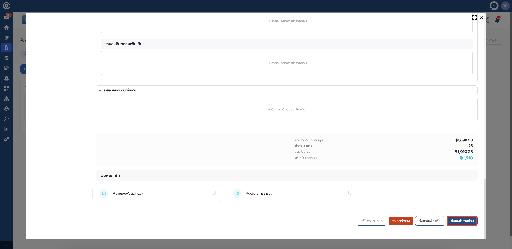<figcaption>
<strong>รูปภาพที่ 80</strong> ระบบมอบหมายงาน - วิธีการยืนยันรายการแจ้งซ่อมเพื่อประมาณราคา
</figcaption></figure>
