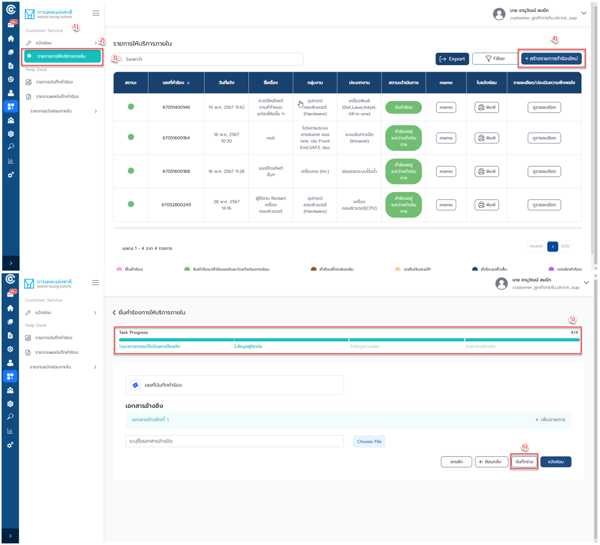

# เจ้าหน้าที่

## **บทที่ 1 วิธีการเข้าใช้งานแอปพลิเคชัน Customer Service (ภายใน)**

#### **วิธีการเข้าใช้งานในส่วนของแอปพลิเคชัน Customer Service (ภายใน)**

1. ไปที่ [centerapp.nha.co.th](https://uat-centerapp.nha.co.th/) จากนั้นเข้าสู่ระบบ
2. ไปที่ Navigation drawer แล้วคลิก “แอปพลิเคชันของฉัน”
3. คลิกเลือก “NHA-DT” ที่ด้านขวาบนของ Center App
4. คลิก “Customer Service”

.png>)

## **บทที่ 2 การใช้งานในส่วนของเมนู Customer Service**

การใช้งานในส่วนของเมนู Customer Service ผู้ใช้งานสามารถแจ้งซ่อม โดยแจ้งบริการภายในได้ดังนี้

### 2.1 แจ้งซ่อม

ผู้ใช้งานสามารถยื่นคำร้องขอให้บริการภายในได้โดยมีขั้นตอนดังต่อไปนี้

#### **วิธีการแจ้งให้บริการภายใน**

1. ไปที่แอปพลิเคชัน “Customer Service”
2. คลิกเมนู “แจ้งซ่อม”
3. คลิก “รายการการให้บริการภายใน”
4. คลิก “+ สร้างรายการคำร้องใหม่”
5. ระบบแสดงหน้า ยื่นคำร้องการให้บริการภายใน จากนั้นผู้ใช้งานกรอกข้อมูลคำร้องการให้บริการภายใน\
   โดยมีขั้นตอนดังนี้
   * แนวทางการแก้ไขปัญหาเบื้องต้น
   * ข้อมูลผู้ติดต่อ
   * ข้อมูลงานซ่อม
   * เอกสารอ้างอิง
6. เมื่อผู้ใช้งานกรอกข้อมูลเรียบร้อยแล้ว คลิกปุ่ม “แจ้งซ่อม”

.png>)

.png>)

#### **วิธีการบันทึกร่างคำร้องการให้บริการภายใน**

1. ไปที่แอปพลิเคชัน “Customer Service”
2. คลิกเมนู “แจ้งซ่อม”
3. คลิก “รายการการให้บริการภายใน”
4. คลิก “+ สร้างรายการคำร้องใหม่
5. ระบบแสดงหน้า ยื่นคำร้องการให้บริการภายใน จากนั้นผู้ใช้งานกรอกข้อมูลคำร้องการให้บริการภายใน\
   โดยมีขั้นตอนดังนี้
   * แนวทางการแก้ไขปัญหาเบื้องต้น
   * ข้อมูลผู้ติดต่อ
   * ข้อมูลงานซ่อม
   * เอกสารอ้างอิง
6. เมื่อผู้ใช้งานกรอกข้อมูลเรียบร้อยแล้ว คลิกปุ่ม “บันทึกร่าง”

#### **วิธีการลบคำร้องรายการให้บริการภายใน**

1. ไปที่แอปพลิเคชัน “Customer Service”
2. คลิกเมนู “แจ้งซ่อม”
3. คลิก “รายการการให้บริการภายใน”
4. ผู้ใช้งานสามารถลบคำร้องรายการให้บริการภายในได้ โดยคลิกที่ “ไอคอนถังขยะ”
5. ระบบจะแสดง Pop Up แจ้งเตือน จากนั้นคลิกปุ่ม “ยืนยัน”

.png>)

#### **วิธีการแก้ไขคำร้องรายการให้บริการภายใน**

1. ไปที่แอปพลิเคชัน “Customer Service”
2. คลิกเมนู “แจ้งซ่อม”
3. คลิก “รายการการให้บริการภายใน”
4. ผู้ใช้งานสามารถแก้ไขคำร้องรายการให้บริการภายในได้ โดยคลิกที่ “ไอคอนดินสอ”
5. ระบบจะแสดงหน้ายื่นคำร้องการให้บริการภายใน ผู้ใช้งานทำการแก้ไขข้อมูลคำร้องการให้บริการภายใน
6. คลิกปุ่ม “แจ้งซ่อม”

.png>)

#### **วิธีการดูรายละเอียดรายการให้บริการภายใน**

1. ไปที่แอปพลิเคชัน “Customer Service”
2. คลิกเมนู “แจ้งซ่อม”
3. คลิก “รายการการให้บริการภายใน”
4. ระบบจะแสดงหน้ารายการให้บริการภายใน
5. ผู้ใช้งานสามารถค้นหารายการให้บริการภายในโดยระบุข้อมูลที่ต้องการค้นหาได้ที่ “ช่องค้นหา”
6. ผู้ใช้งานสามารถใช้ตัวกรอง โดยคลิกปุ่ม “Filter” สามารถกรอง เลขคำร้องแจ้งซ่อม วันที่แจ้งซ่อมตั้งแต่วันที่ถึงวันที่ กลุ่มงาน ประเภทงาน สถานะดำเนินการ ได้
7. ผู้ใช้งานสามารถดาวน์โหลดข้อมูลในหน้าจอได้ โดยคลิกปุ่ม “Export”

.png>)

## **บทที่ 3 การใช้งานในส่วนของเมนู Help Desk**

ผู้ใช้งานสามารถบันทึกคำร้อง ดูรายการบันทึกคำร้อง ดูรายงานผลบันทึกคำร้องได้

### 3.1 บันทึกคำร้อง

#### **วิธีการสร้างรายการคำร้อง**

1. ไปที่เมนู “Help Desk”
2. คลิก “บันทึกคำร้อง”
3. คลิกปุ่ม “+ สร้างรายการคำร้องใหม่”
4. ระบบแสดงหน้า สร้างรายการคำร้อง จากนั้นผู้ใช้งานกรอกข้อมูลรายการคำร้อง โดยมีขั้นตอนดังนี้
   * ข้อมูลผู้ติดต่อ
   * รายละเอียดคำร้อง
   * เอกสารอ้างอิง
5. เมื่อผู้ใช้งานกรอกข้อมูลเรียบร้อยแล้ว คลิกปุ่ม “บันทึกรายการคำร้อง”

.png>)

.png>)

#### **วิธีการบันทึกร่างรายการคำร้อง**

1. ไปที่เมนู “Help Desk”
2. คลิก “บันทึกคำร้อง”
3. คลิกปุ่ม “+ สร้างรายการคำร้องใหม่”
4. ระบบแสดงหน้า สร้างรายการคำร้อง จากนั้นผู้ใช้งานกรอกข้อมูลรายการคำร้อง โดยมีขั้นตอนดังนี้
   * ข้อมูลผู้ติดต่อ
   * รายละเอียดคำร้อง
   * เอกสารอ้างอิง
5. เมื่อผู้ใช้งานกรอกข้อมูลเรียบร้อยแล้ว คลิกปุ่ม “บันทึกร่าง”

.png>)

.png>)

#### **วิธีการดูรายละเอียดบันทึกรายการคำร้อง (Help Desk)**

1. ไปที่เมนู “Help Desk”
2. คลิก “บันทึกคำร้อง”
3. ระบบจะแสดงหน้ารายการให้บริการภายใน
4. ผู้ใช้งานสามารถดูรายละเอียด Memo แต่ละรายการได้ โดยคลิกที่ “memo”
5. ผู้ใช้งานสามารถดาวน์โหลดใบแจ้งซ่อมได้ โดยคลิกที่ “พิมพ์”
6. ผู้ใช้งานสามารถดูบันทึกคำร้องแต่ละรายการได้ โดยคลิกที่ “บันทึกคำร้อง”
7. ผู้ใช้งานสามารถค้นหาบันทึกรายการคำร้อง (Help Desk) โดยระบุข้อมูลที่ต้องการค้นหาได้ที่ “ช่องค้นหา”
8. ผู้ใช้งานสามารถใช้ตัวกรอง โดยคลิกปุ่ม “Filter” สามารถกรอง เลขคำร้องแจ้งซ่อม วันที่แจ้งซ่อมตั้งแต่วันที่ ถึงวันที่ ผู้แจ้งคำร้อง ชื่อหน่วยงานผู้แจ้ง ชื่อผู้รับ หมายเลขครุภัณฑ์ กลุ่มงาน ประเภทงาน สถานะ ได้
9. ผู้ใช้งานสามารถดาวน์โหลดข้อมูลในหน้าจอได้ โดยคลิกปุ่ม “Export”

<figure><figcaption>
<strong>รูปภาพที่ 12</strong> หน้าจอบันทึกคำร้อง – วิธีการดูรายละเอียดบันทึกรายการคำร้อง (Help Desk)
</figcaption></figure>

### 3.2 รายการบันทึกคำร้อง

#### **วิธีการดูรายละเอียดรายการบันทึกคำร้องภายใน**

1. ไปที่เมนู “Help Desk”
2. คลิก “รายการบันทึกคำร้อง”
3. ระบบจะแสดงหน้ารายการบันทึกคำร้องภายใน
4. ผู้ใช้งานสามารถดูรายละเอียด Memo แต่ละรายการได้ โดยคลิกที่ “memo”
5. ผู้ใช้งานสามารถดาวน์โหลดใบแจ้งซ่อมได้ โดยคลิกที่ “พิมพ์”
6. ผู้ใช้งานสามารถดูรายการคำร้องแต่ละรายการได้ โดยคลิกที่ “ตรวจรับคำร้อง”
7. ผู้ใช้งานสามารถค้นหารายการบันทึกคำร้องภายใน โดยระบุข้อมูลที่ต้องการค้นหาได้ที่ “ช่องค้นหา”
8. ผู้ใช้งานสามารถใช้ตัวกรอง โดยคลิกปุ่ม “Filter” สามารถกรอง เลขที่แจ้งซ่อม วันที่แจ้งซ่อมตั้งแต่วันที่ ถึงวันที่ ชื่อผู้แจ้งคำร้อง หน่วยงานผู้แจ้ง ผู้ปฏิบัติงาน หมายเลขครุภัณฑ์ กลุ่มงาน ประเภท สถานะ ได้
9. ผู้ใช้งานสามารถดาวน์โหลดข้อมูลในหน้าจอได้ โดยคลิกปุ่ม “Export”

.png>)

### 3.3 รายงานผลบันทึกคำร้อง

#### **วิธีการดูรายละเอียดรายงานผลบันทึกคำร้อง**

1. ไปที่เมนู “Help Desk”
2. คลิก “รายงานผลบันทึกคำร้อง”
3. ระบบจะแสดงหน้ารายงานผลบันทึกคำร้อง
4. ผู้ใช้งานสามารถดูรายละเอียด Memo แต่ละรายการได้ โดยคลิกที่ “memo”
5. ผู้ใช้งานสามารถดาวน์โหลดใบแจ้งซ่อมได้ โดยคลิกที่ “พิมพ์”
6. ผู้ใช้งานสามารถดูรายการคำร้องแต่ละรายการได้ โดยคลิกที่ “รายงานผล”
7. ผู้ใช้งานสามารถค้นหารายงานผลบันทึกคำร้อง โดยระบุข้อมูลที่ต้องการค้นหาได้ที่ “ช่องค้นหา”
8. ผู้ใช้งานสามารถใช้ตัวกรอง โดยคลิกปุ่ม “Filter” สามารถกรอง เลขที่แจ้งซ่อม วันที่แจ้งซ่อมตั้งแต่วันที่ ถึงวันที่ กลุ่มงาน ประเภทงาน สถานะ ชื่อผู้แจ้งคำร้อง หน่วยงานผู้แจ้ง ผู้ปฏิบัติงาน หมายเลขครุภัณฑ์ ปีงบประมาณ ได้
9. ผู้ใช้งานสามารถดาวน์โหลดข้อมูลในหน้าจอได้ โดยคลิกปุ่ม “Export”

.png>)

## **บทที่ 4 การใช้งานในส่วนของเมนู รายงานแจ้งซ่อมภายใน**

ผู้ใช้งานสามารถดู รายงานแจ้งซ่อมภายใน โดยจะต้องมีสิทธิ์เป็นผู้ดูแล จึงจะสามารถดูรายงานได้

### 4.1 รายงาน

ผู้ใช้งานสามารถดู รายงาน ได้ดังนี้

#### **4.1.1 รายงาน SLA**

**วิธีการดูรายงาน SLA**

1. ไปที่เมนู “Help Desk”
2. คลิกเมนู “รายงานแจ้งซ่อมภายใน”
3. คลิก “รายงาน SLA”
4. ผู้ใช้งานสามารถค้นหารายงาน SLA ได้ โดยการใช้ตัวกรอง
   * เมื่อคลิกปุ่ม “พิมพ์รายงาน” ระบบจะแสดงหน้าป๊อบอัพดาวน์โหลดรายงาน ผู้ใช้งานสามารถเลือกรูปแบบดาวน์โหลดรายงานได้
   * เมื่อคลิกปุ่ม “ล้างข้อมูล” ระบบจะล้างข้อมูลที่ระบุในตัวกรอง และแสดงเป็นค่าว่าง

.png>)

#### **4.1.2 รายงานคำร้องคงค้างที่เกินกำหนดเวลา**

**วิธีการดูรายงานคำร้องคงค้างที่เกินกำหนดเวลา**

1. ไปที่เมนู “Help Desk”
2. คลิกเมนู “รายงานแจ้งซ่อมภายใน”
3. คลิก “รายงานคำร้องคงค้างที่เกินกำหนดเวลา”
4. ผู้ใช้งานสามารถค้นหารายงานคำร้องคงค้างที่เกินกำหนดเวลา ได้ โดยการใช้ตัวกรอง
   * เมื่อคลิกปุ่ม “พิมพ์รายงาน” ระบบจะแสดงหน้าป๊อบอัพดาวน์โหลดรายงาน ผู้ใช้งานสามารถเลือกรูปแบบดาวน์โหลดรายงานได้
   * เมื่อคลิกปุ่ม “ล้างข้อมูล” ระบบจะล้างข้อมูลที่ระบุในตัวกรอง และแสดงเป็นค่าว่าง

.png>)

#### **4.1.3 รายงานการซ่อมบำรุง**

**วิธีการดูรายงานการซ่อมบำรุง**

1. ไปที่เมนู “Help Desk”
2. คลิกเมนู “รายงานแจ้งซ่อมภายใน”
3. คลิก “รายงานการซ่อมบำรุง”
4. ผู้ใช้งานสามารถค้นหารายงานการซ่อมบำรุง ได้โดยการใช้ตัวกรอง
   * เมื่อคลิกปุ่ม “พิมพ์รายงาน” ระบบจะแสดงหน้าป๊อบอัพดาวน์โหลดรายงาน ผู้ใช้งานสามารถเลือกรูปแบบดาวน์โหลดรายงานได้
   * เมื่อคลิกปุ่ม “ล้างข้อมูล” ระบบจะล้างข้อมูลที่ระบุในตัวกรอง และแสดงเป็นค่าว่าง

.png>)

#### **4.1.4 รายงานประวัติการซ่อมครุภัณฑ์**

**วิธีการดูรายงานประวัติการซ่อมครุภัณฑ์**

1. ไปที่เมนู “Help Desk”
2. คลิกเมนู “รายงานแจ้งซ่อมภายใน”
3. คลิก “รายงานประวัติการซ่อมครุภัณฑ์”
4. ผู้ใช้งานสามารถค้นหารายงานประวัติการซ่อมครุภัณฑ์ ได้โดยการใช้ตัวกรอง
   * เมื่อคลิกปุ่ม “พิมพ์รายงาน” ระบบจะแสดงหน้าป๊อบอัพดาวน์โหลดรายงาน ผู้ใช้งานสามารถเลือกรูปแบบดาวน์โหลดรายงานได้
   * เมื่อคลิกปุ่ม “ล้างข้อมูล” ระบบจะล้างข้อมูลที่ระบุในตัวกรอง และแสดงเป็นค่าว่าง

.png>)

#### **4.1.5 รายงานสรุปผลการประเมินความพึงพอใจ**

**วิธีการดูรายงานสรุปผลการประเมินความพึงพอใจ**

1. ไปที่เมนู “Help Desk”
2. คลิกเมนู “รายงานแจ้งซ่อมภายใน”
3. คลิก “รายงานสรุปผลการประเมินความพึงพอใจ”
4. ผู้ใช้งานสามารถค้นหารายงานสรุปผลการประเมินความพึงพอใจ ได้โดยการใช้ตัวกรอง
   * เมื่อคลิกปุ่ม “พิมพ์รายงาน” ระบบจะแสดงหน้าป๊อบอัพดาวน์โหลดรายงาน ผู้ใช้งานสามารถเลือกรูปแบบดาวน์โหลดรายงานได้
   * เมื่อคลิกปุ่ม “ล้างข้อมูล” ระบบจะล้างข้อมูลที่ระบุในตัวกรอง และแสดงเป็นค่าว่าง

.png>)

#### **4.1.6 รายงานสรุปจำนวนคำขอจำแนกตามผู้ปฏิบัติงาน**

**วิธีการดู**รายงานสรุปจำนวนคำขอจำแนกตามผู้ปฏิบัติงาน

1. ไปที่เมนู “Help Desk”
2. คลิกเมนู “รายงานแจ้งซ่อมภายใน”
3. คลิก “รายงานสรุปจำนวนคำขอจำแนกตามผู้ปฏิบัติงาน”
4. ผู้ใช้งานสามารถค้นหารายงานสรุปจำนวนคำขอจำแนกตามผู้ปฏิบัติงาน ได้ โดยการใช้ตัวกรอง
   * เมื่อคลิกปุ่ม “พิมพ์รายงาน” ระบบจะแสดงหน้าป๊อบอัพดาวน์โหลดรายงาน ผู้ใช้งานสามารถเลือกรูปแบบดาวน์โหลดรายงานได้
   * เมื่อคลิกปุ่ม “ล้างข้อมูล” ระบบจะล้างข้อมูลที่ระบุในตัวกรอง และแสดงเป็นค่าว่าง

.png>)

#### **4.1.7 รายงานผลการดำเนินงานจำแนกตามผู้ปฏิบัติงาน**

**วิธีการดูรายงานสรุปจำนวนคำขอจำแนกตามผู้ปฏิบัติงาน**

1. ไปที่เมนู “Help Desk”
2. คลิกเมนู “รายงานแจ้งซ่อมภายใน”
3. คลิก “รายงานผลการดำเนินงานจำแนกตามผู้ปฏิบัติงาน”
4. ผู้ใช้งานสามารถค้นหารายงานผลการดำเนินงานจำแนกตามผู้ปฏิบัติงาน ได้โดยการใช้ตัวกรอง
   * เมื่อคลิกปุ่ม “พิมพ์รายงาน” ระบบจะแสดงหน้าป๊อบอัพดาวน์โหลดรายงาน ผู้ใช้งานสามารถเลือกรูปแบบดาวน์โหลดรายงานได้
   * เมื่อคลิกปุ่ม “ล้างข้อมูล” ระบบจะล้างข้อมูลที่ระบุในตัวกรอง และแสดงเป็นค่าว่าง

<figure><figcaption>
<strong>รูปภาพที่ 21</strong> หน้าจอรายงาน – รายงานผลการดำเนินงานจำแนกตามผู้ปฏิบัติงาน
</figcaption></figure>

#### **4.1.8 รายงานรายละเอียดการปฏิบัติงาน**

**วิธีการดูรายงานรายละเอียดการปฏิบัติงาน**

1. ไปที่เมนู “Help Desk”
2. คลิกเมนู “รายงานแจ้งซ่อมภายใน”
3. คลิก “รายงานรายละเอียดการปฏิบัติงาน”
4. ผู้ใช้งานสามารถค้นหารายงานรายละเอียดการปฏิบัติงาน ได้โดยการใช้ตัวกรอง
   * เมื่อคลิกปุ่ม “พิมพ์รายงาน” ระบบจะแสดงหน้าป๊อบอัพดาวน์โหลดรายงาน ผู้ใช้งานสามารถเลือกรูปแบบดาวน์โหลดรายงานได้
   * เมื่อคลิกปุ่ม “ล้างข้อมูล” ระบบจะล้างข้อมูลที่ระบุในตัวกรอง และแสดงเป็นค่าว่าง

<figure><figcaption>
<strong>รูปภาพที่ 22</strong> หน้าจอรายงาน – รายงานรายละเอียดการปฏิบัติงาน
</figcaption></figure>
