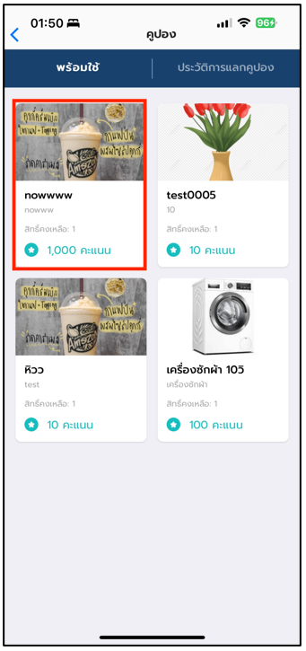
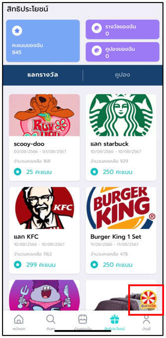

# ผู้ใช้งาน

## **บทที่ 1 วิธีการเข้าใช้งานแอปพลิเคชัน Loyalty**

### วิธีการเข้าใช้งานในส่วนของแอปพลิเคชัน Loyalty

1. ไปที่ [home.nha.co.th](http://home.nha.co.th/nha\_dt/) จากนั้นเข้าสู่ระบบ
2. ไปที่ Menu Bar แล้วคลิก “**พอยท์สะสม/สิทธิประโยชน์**”

.png>)

## **บทที่ 2 การใช้งานในส่วนของเมนู Activity**

การใช้งานในส่วนของเมนู Activity จะประกอบไปด้วย 4 เมนูหลัก ดังต่อไปนี้

### 2.1 บัตรสมาชิก

ผู้ใช้งานสามารถดูข้อมูลรายละเอียดของสมาชิก ตัวอย่างบัตรสมาชิก ระดับของสมาชิก พอยท์สะสม สิทธิประโยชน์ วันหมดอายุบัตรสมาชิก

#### **วิธีการเข้าใช้งานในส่วนของเมนู บัตรสมาชิก และ QR Code**

1. ไปที่เมนู “พอยท์สะสม/สิทธิประโยชน์”
2. คลิกเมนู “บัตรสมาชิก”
3. ผู้ใช้งานคลิกปุ่ม   แสดง “QR Code”

.png>)

.png>)

### 2.2 สิทธิประโยชน์

ผู้ใช้งานสามารถดูสิทธิประโยชน์ต่างๆที่ตัวเองได้รับ

#### **วิธีการเข้าใช้งานในส่วนของเมนู สิทธิประโยชน์**

1. คลิกเมนู “สิทธิประโยชน์”
2. ผู้ใช้งานสามารถ “ค้นหา” รายการสิทธิประโยชน์ที่ได้รับ
3. ผู้ใช้งานสามารถคลิก “ใช้สิทธิ์” สิทธิประโยชน์
4. ผู้ใช้งานสามารถคลิก “รายการสิทธิประโยชน์” เพื่อดูข้อมูลรายละเอียดได้

<figure><figcaption>
<strong>รูปภาพที่ 4</strong> การแสดงรายการและใช้งานสิทธิ์สิทธิประโยชน์
</figcaption></figure>

#### **แสดงรายละเอียดสิทธิประโยชน์**

ผู้ใช้งานสามารถดูรายละเอียดของสิทธิประโยชน์ที่ตัวเองได้รับ

1. คลิก “รายการสิทธิประโยชน์”
2. ระบบแสดงป๊อปอัพรายละเอียดของสิทธิประโยชน์ที่ได้รับ
3. ผู้ใช้งานสามารถคลิก “ใช้งาน”

.png>)

.png>)

### 2.3 แลกของรางวัล/คูปอง

การใช้งานในส่วนของเมนู Activity จะประกอบไปด้วย 4 เมนูหลัก ดังต่อไปนี้

#### **วิธีการแลกของรางวัล/คูปอง**

1. คลิก “แลกของรางวัล/คูปอง
2. ผู้ใช้งานสามารถ “ค้นหา” รายการของรางวัล/คูปอง
3. ผู้ใช้งานสามารคลิก “ใช้งาน” แลกของรางวัล/คูปอง
4. ผู้ใช้งานสามารถดูจำนวนพอยท์สะสมได้
5. ผู้ใช้งานสามารถคลิก “Filter” เพื่อกรองรายการของรางวัล/คูปอง

.png>)

### 2.4 ประวัติการทำรายการ

ผู้ใช้งานสามารถดูประวัติการทำรายการ วันที่ทำรายการ กิจกรรมที่ทำรายการ ประเภทของรายการ รายละเอียดกิจกรรม พอยท์ที่ใช้ สถานะ ดังนี้

#### **วิธีการดูประวัติการทำรายการ**

1. คลิก “ประวัติการทำรายการ”
2. ผู้ใช้งานสามารถ “ค้นหาประวัติการทำรายการ”
3. ผู้ใช้งานสามารถ “กรองข้อมูล” ข้อมูลประวัติการทำรายการ
4. ผู้ใช้งานคลิก “ส่งออกข้อมูล” เพื่อส่งออกข้อมูลประวัตการทำรายการ

ระบบจะแสดงตัวเลือกรูปแบบข้อมูลที่ต้องการส่งออก คือ CSV และ Excel เมื่อผู้ใช้งานเลือกระบบจะส่งออกข้อมูลตามรูปแบบที่ผู้ใช้งานเลือก

.png>)

.png>)

## **บทที่ 3 วิธีการเข้าใช้งานแอปพลิเคชัน Loyalty (Mobile)**

วิธีการเข้าใช้งานในส่วนของแอปพลิเคชัน Loyalty

1. ไปที่แอพพลิเคชั่น “NHA Services”

<figure><figcaption>
<strong>รูปภาพที่ 10</strong> แอพพลิเคชั่น NHA Services
</figcaption></figure>

2. ไปที่ navigation bar แล้วคลิก “สิทธิประโยชน์

<figure><figcaption>
<strong>รูปภาพที่ 11</strong> หน้าจอสิทธิประโยชน์
</figcaption></figure>

### **3.1 แลกของรางวัล**

ผู้ใช้งานสามารถแลกของรางวัลที่ได้รับ

#### **วิธีการแลกของรางวัล/คูปอง**

1. คลิกแถบเมนู “แลกรางวัล”
2. คลิก “ของรางวัล” ที่ต้องการแลก
3. ระบบแสดงป็อปอัพรายละเอียดข้อมูลของรางวัลและคูปอง
4. ผู้ใช้งานคลิก “แลกคะแนน”

<figure><figcaption>
<strong>รูปภาพที่ 12</strong> วิธีแลกของรางวัล
</figcaption></figure>

<figure><figcaption>
<strong>รูปภาพที่ 13</strong> วิธีแลกของรางวัล
</figcaption></figure>

### **3.2 รับคูปอง**

ผู้ใช้งานสามารถแลกของรางวัลที่ได้รับ

#### **วิธีการแลกคูปอง**

1. คลิกแถบเมนู “คูปอง”
2. คลิก “คูปอง” ที่ต้องการแลก
3. ระบบแสดงป็อปอัพรายละเอียดข้อมูลของรางวัลและคูปอง
4. ผู้ใช้งานคลิก “รับคูปอง”

<figure><figcaption>
<strong>รูปภาพที่ 14</strong> หน้าจอแลกคูปอง
</figcaption></figure>

<figure><figcaption>
<strong>รูปภาพที่ 15</strong> วิธีแลกของคูปอง
</figcaption></figure>

### **3.3 การใช้สิทธิ์แลกของรางวัล**

ผู้ใช้งานใช้สิทธิ์แลกของรางวัลที่เคยได้รับสิทธิ์เอาไว้

#### **วิธีการแลกคูปอง**

1. คลิกการ์ด “รางวัลของฉัน”
2. คลิก “รายการรางวัล” ที่ต้องการแลก
3.  คลิก “ใช้รางวัล”

    <figure><figcaption>
<strong>รูปภาพที่ 16</strong> วิธีใช้งานการรับของรางวัล
</figcaption></figure>

<figure><figcaption>
<strong>รูปภาพที่ 17</strong> วิธีใช้งานการรับของรางวัล – เลือกรายการรับของรางวัล
</figcaption></figure>

<figure><figcaption>
<strong>รูปภาพที่ 18</strong> วิธีใช้งานการรับของรางวัล – รับรางวัล
</figcaption></figure>

### **3.4 ประวัติการใช้งานการแลกรางวัล**

ผู้ใช้งานดูประวัติการแลกรางวัล

#### **วิธีการดูประวัติการแลกของรางวัล**

1. คลิกแถบ “ประวัติการแลกรางวัล”
2.  ผู้ใช้งานสามารถดูข้อมูล “รายการประวัติ” ที่เคยแลก

    <figure><figcaption>
<strong>รูปภาพที่ 19</strong> ประวัติการแลกรางวัล
</figcaption></figure>

### **3.5 การใช้สิทธิ์แลกคูปอง**

ผู้ใช้งานใช้สิทธิ์แลกของคูปองที่เคยได้รับสิทธิ์เอาไว้

#### **วิธีการแลกคูปอง**

1. คลิกการ์ด “คูปองของฉัน”
2. คลิก “รายการคูปอง” ที่ต้องการใช้สิทธิ์
3.  คลิก “ใช้รางวัล”

    <figure><figcaption>
<strong>รูปภาพที่ 20</strong> วิธีการใช้งานคูปอง
</figcaption></figure>

<figure><figcaption>
<strong>รูปภาพที่ 21</strong> วิธีการใช้งานคูปอง – เลือกรายการ
</figcaption></figure>

<figure><figcaption>
<strong>รูปภาพที่ 22</strong> วิธีการใช้งานคูปอง – ใช้งานคูปอง
</figcaption></figure>

### **3.6 การสุ่มรางวัล**

ผู้ใช้งานทำการสุ่มรางวัล ระบบจะทำการสุ่มคะแนนให้กับผู้ใช้งาน ตามการสุ่มของวงล้อ

#### **วิธีการแลกคูปอง**

1. คลิก “วงล้อ”
2. คลิก “หมุน” เพื่อทำการสุ่มวงล้อ
3. ระบบทำการสุ่มของรางวัลให้กับผู้ใช้งาน

<figure><figcaption>
<strong>รูปภาพที่ 23</strong> วิธีการสุ่มรางวัล
</figcaption></figure>

<figure><figcaption>
<strong>รูปภาพที่ 24</strong> สุ่มรางวัล
</figcaption></figure>

<figure><figcaption>
<strong>รูปภาพที่ 25</strong> ผลรางวัล
</figcaption></figure>
